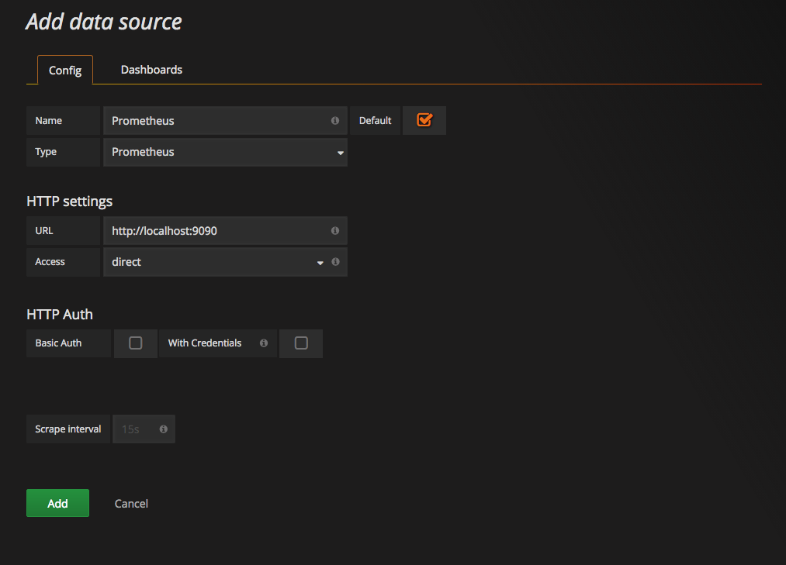

# Prometheus 入门笔记

中文文档：https://yunlzheng.gitbook.io/prometheus-book/

官方文档：https://prometheus.io/docs/prometheus/latest/getting_started/


## Prometheus 快速入门

[Prometheus](https://github.com/prometheus)是一个开源系统监控和警报工具包，最初在 [SoundCloud](https://soundcloud.com/)构建。自 2012 年成立以来，许多公司和组织都采用了 Prometheus，该项目拥有非常活跃的开发者和用户[社区](https://prometheus.io/community)。它现在是一个独立的开源项目，独立于任何公司维护。为了强调这一点，并明确项目的治理结构，Prometheus 于 2016 年加入 [云原生计算基金会，成为继](https://cncf.io/)[Kubernetes](https://kubernetes.io/)之后的第二个托管项目。


### Prometheus 架构图


### 安装 Prometheus Server

Prometheus基于Golang编写，编译后的软件包，不依赖于任何的第三方依赖。用户只需要下载对应平台的二进制包，解压并且添加基本的配置即可正常启动Prometheus Server。

#### 二进制包安装

对于非Docker用户，可以从https://prometheus.io/download/找到最新版本的Prometheus Sevrer软件包：

```sh
# 下载
curl -LO  https://github.com/prometheus/prometheus/releases/download/v2.35.0/prometheus-2.35.0.linux-amd64.tar.gz

# 解压
tar vxzf prometheus-2.35.0.linux-amd64.tar.gz
cd prometheus-2.35.0.linux-amd64

# 运行
./prometheus --config.file=./prometheus.yml
```

#### 使用容器安装

对于Docker用户，直接使用Prometheus的镜像即可启动Prometheus Server：

```sh
docker run -p 9090:9090 -v /etc/prometheus/prometheus.yml:/etc/prometheus/prometheus.yml prom/prometheus
```

启动完成后，可以通过http://localhost:9090访问Prometheus的UI界面：


### 使用 Node Exporter 采集主机数据

在Prometheus的架构设计中，Prometheus Server并不直接服务监控特定的目标，其主要任务负责数据的收集，存储并且对外提供数据查询支持。因此为了能够能够监控到某些东西，如主机的CPU使用率，我们需要使用到Exporter。Prometheus周期性的从Exporter暴露的HTTP服务地址（通常是/metrics）拉取监控样本数据。

从上面的描述中可以看出Exporter可以是一个相对开放的概念，其可以是一个独立运行的程序独立于监控目标以外，也可以是直接内置在监控目标中。只要能够向Prometheus提供标准格式的监控样本数据即可。

#### 安装 Node Exporter

下载地址：https://prometheus.io/download/#node_exporter

```sh
curl -LO https://github.com/prometheus/node_exporter/releases/download/v1.3.1/node_exporter-1.3.1.linux-amd64.tar.gz
tar xvfz node_exporter-1.3.1.linux-amd64.tar.gz
cd node_exporter-1.3.1.linux-amd64
./node_exporter
```

访问[http://localhost:9100/](http://localhost:9100)可以看到以下页面：


#### 初始化 Node Exporter 监控指标

访问http://localhost:9100/metrics，可以看到当前node exporter获取到的当前主机的所有监控数据，如下所示：

```sh
curl http://localhost:9100/metrics

# HELP go_gc_duration_seconds A summary of the pause duration of garbage collection cycles.
# TYPE go_gc_duration_seconds summary
go_gc_duration_seconds{quantile="0"} 0
go_gc_duration_seconds{quantile="0.25"} 0
go_gc_duration_seconds{quantile="0.5"} 0
go_gc_duration_seconds{quantile="0.75"} 0
go_gc_duration_seconds{quantile="1"} 0
go_gc_duration_seconds_sum 0
go_gc_duration_seconds_count 0
```

#### 从 Node Exporter 收集监控数据

为了能够让Prometheus Server能够从当前node exporter获取到监控数据，这里需要修改Prometheus配置文件。编辑prometheus.yml并在scrape_configs节点下添加以下内容：

```yml
scrape_configs:
  - job_name: 'prometheus'
    static_configs:
      - targets: ['localhost:9090']
  # 采集node exporter监控数据
  - job_name: 'node'
    static_configs:
      - targets: ['localhost:9100']
```

重新启动Prometheus Server

访问http://localhost:9090，进入到Prometheus Server。如果输入“up”并且点击执行按钮以后，可以看到如下结果：


### 使用 PromQL 查询监控数据

Prometheus UI是Prometheus内置的一个可视化管理界面，通过Prometheus UI用户能够轻松的了解Prometheus当前的配置，监控任务运行状态等。 通过`Graph`面板，用户还能直接使用`PromQL`实时查询监控数据：


```sh
node_cpu_seconds_total
rate(node_cpu_seconds_total{mode="system"}[1m])
```

### 监控数据可视化

Prometheus UI提供了快速验证PromQL以及临时可视化支持的能力，而在大多数场景下引入监控系统通常还需要构建可以长期使用的监控数据可视化面板（Dashboard）。这时用户可以考虑使用第三方的可视化工具如Grafana，Grafana是一个开源的可视化平台，并且提供了对Prometheus的完整支持。

```sh
docker run -d -p 3000:3000 grafana/grafana
```

访问http://localhost:3000就可以进入到Grafana的界面中，默认情况下使用账户admin/admin进行登录。在Grafana首页中显示默认的使用向导，包括：安装、添加数据源、创建Dashboard、邀请成员、以及安装应用和插件等主要流程:


这里将添加Prometheus作为默认的数据源，如下图所示，指定数据源类型为Prometheus并且设置Prometheus的访问地址即可，在配置正确的情况下点击“Add”按钮，会提示连接成功的信息：




### 任务和实例


### Prometheus 核心组件


## 探索 PromQL


## Prometheus 告警处理


## Exporter 详解


## 数据与可视化


## 集群与高可用


## Prometheus 服务发现


## 监控 Prometheus


## Prometheus Operator