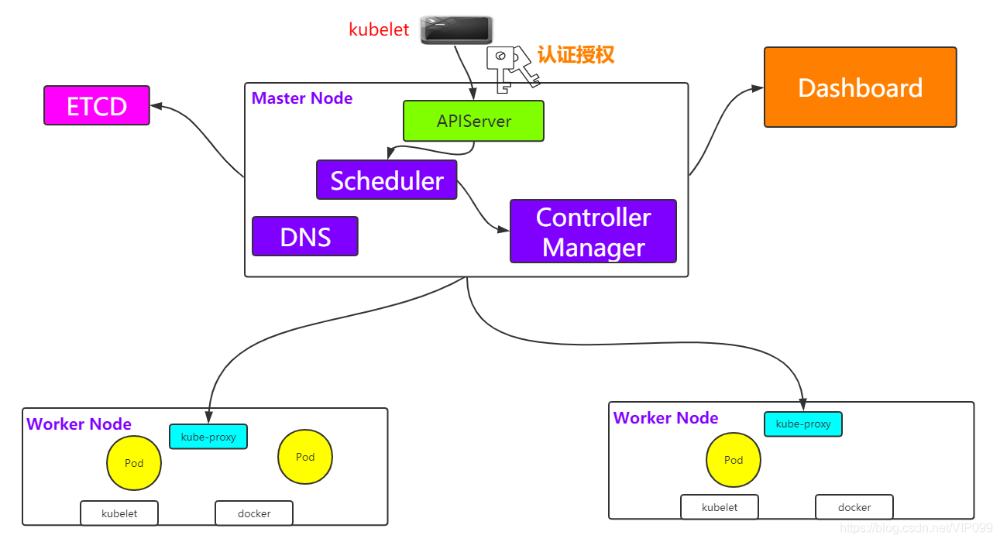
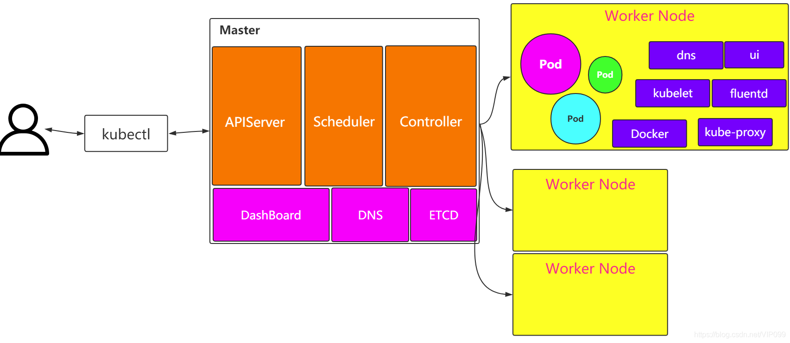
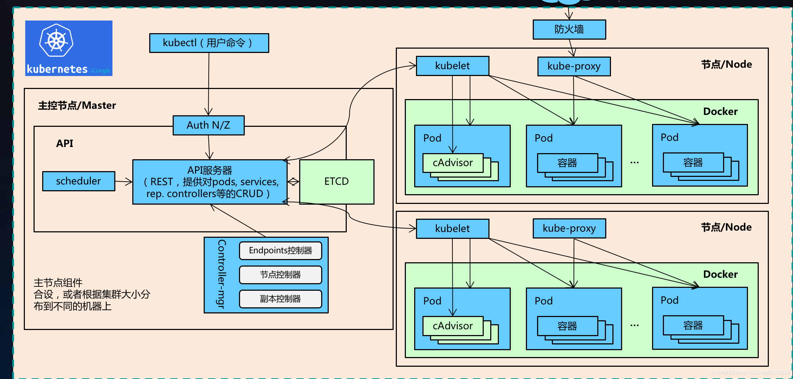
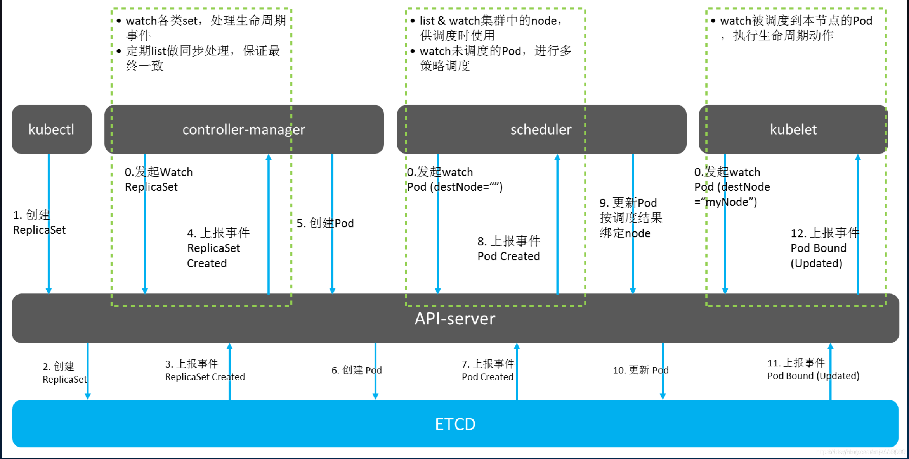

# Kubernetes 入门笔记


## 前置内容

- Linux | [Linux 入门笔记]()
- Docker | [Docker 入门笔记]()


## 目录

- 1  Kubernetes 概念和架构

- 2  从零搭建 Kubernetes 集群
  - 基于客户端工具 kubeadm
  
  - 基于二进制包
  
- 3  Kubernetes 核心概念
  - Pod
  - Controller
  - Service Ingress
  - RABC
  - Helm
  
- 4  搭建集群监控平台系统

- 5  从零搭建高可用 Kubernetess 集群

- 6  在集群环境中部署项目


## 1  Kubernetes 概述和架构

### 1.1 Kubernetes 简介

Kubernetes，首字母K，尾字母s，中间8个字母，简称K8s。

### 1.2 Kubernetes 功能

> 目前只需要知道 Kubernetes 有以下 9 个功能，关于这 9 个功能，后面详细介绍。（我也不知道这些是啥玩意，先记住名词再说）

1. 自动装箱

   - 基于容器对应用运行环境的资源配置要求自动部署应用容器

2. 自我修复

   - 当容器失败时，会对容器进行重启

   - 当所部署的Node节点有问题时，会对容器进行重新部署和重新调度

   - 当容器未通过监控检查时，会关闭此容器直到容器正常运行时，才会对外提供服务

3. 水平扩展

   - 通过简单的命令、用户UI 界面或基于CPU 等资源使用情况，对应用容器进行规模扩大或规模剪裁

   - 当我们有大量的请求来临时，我们可以增加副本数量，从而达到水平扩展的效果

4. 服务发现

   - 用户不需使用额外的服务发现机制，就能够基于Kubernetes 自身能力实现服务发现和负载均衡

5. 滚动更新
   - 可以根据应用的变化，对应用容器运行的应用，进行一次性或批量式更新

6. 版本回退
   - 可以根据应用部署情况，对应用容器运行的应用，进行历史版本即时回退

7. 密钥和配置管理

   - 在不需要重新构建镜像的情况下，可以部署和更新密钥和应用配置，类似热部署。

8. 存储编排

   - 自动实现存储系统挂载及应用，特别对有状态应用实现数据持久化非常重要

   - 存储系统可以来自于本地目录、网络存储(NFS、Gluster、Ceph 等)、公共云存储服务

9. 批处理

   - 提供一次性任务，定时任务；满足批量数据处理和分析的场景

### 1.3 Kubernetes 架构组件

**Kuebrnetes 架构图**

> Kubernetes 架构主要包含两部分：Master（主控节点）和 Work node（工作节点）。

---

图1 



----

图2



-----

图3



---

**Kubernetes 组件**

- **Master**：主控节点
  - API Server：集群统一入口，以restful风格进行操作，同时交给etcd存储
    - 提供认证、授权、访问控制、API注册和发现等机制
  - scheduler：节点的调度，选择node节点应用部署
  - controller-manager：处理集群中常规后台任务，一个资源对应一个控制器
  - etcd：存储系统，用于保存集群中的相关数据

- **Worker node**：工作节点
  - Kubelet：master派到node节点代表，管理本机容器
    - 一个集群中每个节点上运行的代理，它保证容器都运行在Pod中
    - 负责维护容器的生命周期，同时也负责Volume(CSI) 和 网络(CNI)的管理
  - kube-proxy：提供网络代理，负载均衡等操作
- 容器运行环境【**Container Runtime**】
  - 容器运行环境是负责运行容器的软件
  - Kubernetes支持多个容器运行环境：Docker、containerd、cri-o、rktlet以及任何实现Kubernetes CRI (容器运行环境接口) 的软件。
- fluentd：是一个守护进程，它有助于提升集群层面日志

### 1.4 Kubernetes 核心概念

1. Pod
   - Pod是K8s中最小的单元
   - 一组容器的集合
   - 共享网络【一个Pod中的所有容器共享同一网络】
   - 生命周期是短暂的（服务器重启后，就找不到了）

2. Volume
   - 声明在Pod容器中可访问的文件目录
   - 可以被挂载到Pod中一个或多个容器指定路径下
   - 支持多种后端存储抽象【本地存储、分布式存储、云存储】

3. Controller

   - 确保预期的pod副本数量【ReplicaSet】
   - 无状态应用部署【Deployment】
     - 无状态就是指，不需要依赖于网络或者ip

   - 有状态应用部署【StatefulSet】
     - 有状态需要特定的条件

   - 确保所有的node运行同一个pod 【DaemonSet】

   - 一次性任务和定时任务【Job和CronJob】

4. Deployment

   - 定义一组Pod副本数目，版本等
   - 通过控制器【Controller】维持Pod数目【自动回复失败的Pod】
   - 通过控制器以指定的策略控制版本【滚动升级、回滚等】

5. Service
   - 定义一组pod的访问规则
   - Pod的负载均衡，提供一个或多个Pod的稳定访问地址
   - 支持多种方式【ClusterIP、NodePort、LoadBalancer】

6. Label
   - label：标签，用于对象资源查询，筛选
7. Namespace
   - 命名空间，逻辑隔离
   - 一个集群内部的逻辑隔离机制【鉴权、资源】
   - 每个资源都属于一个namespace
   - 同一个namespace所有资源不能重复
   - 不同namespace可以资源名重复

8. API
   - 我们通过Kubernetes的API来操作整个集群
   - 同时我们可以通过 kubectl 、ui、curl 最终发送 http + json/yaml 方式的请求给API Server，然后控制整个K8S集群，K8S中所有的资源对象都可以采用 yaml 或 json 格式的文件定义或描述

### 1.5 Kubernetes 工作原理

**Kubernetes 工作原理图**

> 能看懂就看，看不懂就算了，俺也看不懂。

---




## 2  从零开始搭建K8s集群

### 2.1 基于客户端工具 kubeadm

kubeadm是官方社区推出的一个用于快速部署kubernetes集群的工具。

这个工具能通过两条指令完成一个kubernetes集群的部署：

```sh
# 创建一个 Master 节点
kubeadm init

# 将一个 Worker node 节点加入到当前集群中
kubeadm join <Master节点的IP和端口 >
```

#### 2.1.1 安装步骤

使用kubeadm方式搭建 Kubernetes 集群主要分为以下几步：

1. **【环境准备】**准备三台虚拟机，并安装操作系统 CentOS 7.x
2. **【系统初始化】**对三个刚安装好的操作系统进行初始化操作
3. **【安装工具】**在三个节点安装 `docker` `kubelet` `kubeadm` `kubectl`
4. **【集群部署-master】**在master节点执行`kubeadm init`命令初始化
5. **【集群部署-node】**在node节点上执行 `kubeadm join`命令，把node节点添加到当前集群
6. **【安装网络插件】**配置CNI网络插件，用于节点之间的连通
7. **【测试集群】**通过拉取一个nginx进行测试，能否进行外网测试

####  2.1.2 安装要求

在开始之前，部署 Kubernetes 集群机器需要满足以下几个条件：

- 一台或多台机器，操作系统 CentOS7.x-86_x64
- 硬件配置：2GB或更多RAM，2个CPU或更多CPU，硬盘30GB或更多**【注意】【注意】【注意】【master需要两核】**
- 可以访问外网，需要拉取镜像，如果服务器不能上网，需要提前下载镜像并导入节点
- 禁止swap分区

#### 2.1.3  准备环境

> 不会配置环境的可以参考 [Linux 入门笔记 | 虚拟机 IP 配置]()

| 角色      | IP             | 命令                                 | 配置  |
| --------- | -------------- | ------------------------------------ | ----- |
| k8smaster | 192.168.60.151 | `hostnamectl set-hostname k8smaster` | 2C 2G |
| k8snode1  | 192.168.60.152 | `hostnamectl set-hostname k8snode1`  | 2C 2G |
| k8snode2  | 192.168.60.153 | `hostnamectl set-hostname k8snode2`  | 2C 2G |

#### 2.1.4  系统初始化

在每台机器上执行下面的命令：

```sh
# 关闭防火墙
systemctl stop firewalld
# 禁用firewalld服务
systemctl disable firewalld

# 关闭selinux
# 永久关闭
sed -i 's/enforcing/disabled/' /etc/selinux/config  
# 临时关闭
setenforce 0  

查看swap
free
# 关闭swap
# 临时
swapoff -a 
# 永久关闭
sed -ri 's/.*swap.*/#&/' /etc/fstab

# 可以只在master添加hosts
cat >> /etc/hosts << EOF
192.168.60.151 k8smaster
192.168.60.152 k8snode1
192.168.60.153 k8snode2
EOF

# 将桥接的IPv4流量传递到iptables的链
cat > /etc/sysctl.d/k8s.conf << EOF
net.bridge.bridge-nf-call-ip6tables = 1
net.bridge.bridge-nf-call-iptables = 1
EOF
# 生效
sysctl --system  

# 时间同步
yum install ntpdate -y
ntpdate time.windows.com
```

#### 2.1.5  安装组件

所有节点需要安装以下组件 ，Kubernetes默认CRI（容器运行时）为Docker，因此先安装Docker。

- Docker
- kubeadm
- kubelet
- kubectl

**1、安装 Docker**

首先配置一下Docker的阿里yum源：

```sh
cat >/etc/yum.repos.d/docker.repo<<EOF
[docker-ce-edge]
name=Docker CE Edge - \$basearch
baseurl=https://mirrors.aliyun.com/docker-ce/linux/centos/7/\$basearch/edge
enabled=1
gpgcheck=1
gpgkey=https://mirrors.aliyun.com/docker-ce/linux/centos/gpg
EOF
```

然后yum方式安装docker：

```sh
# yum安装
yum -y install docker-ce

# 查看docker版本
docker --version  

# 启动docker
systemctl enable docker
systemctl start docker
```

配置docker的镜像源：

```sh
cat >> /etc/docker/daemon.json << EOF
{
  "registry-mirrors": ["https://b9pmyelo.mirror.aliyuncs.com"]
}
EOF
```

然后重启docker：

```sh
systemctl restart docker
```

**2、添加 kubernetes 软件源**

配置yum的k8s软件源：

```sh
cat > /etc/yum.repos.d/kubernetes.repo << EOF
[kubernetes]
name=Kubernetes
baseurl=https://mirrors.aliyun.com/kubernetes/yum/repos/kubernetes-el7-x86_64
enabled=1
gpgcheck=0
repo_gpgcheck=0
gpgkey=https://mirrors.aliyun.com/kubernetes/yum/doc/yum-key.gpg https://mirrors.aliyun.com/kubernetes/yum/doc/rpm-package-key.gpg
EOF
```

**3、安装kubeadm，kubelet和kubectl**

由于版本更新频繁，这里指定版本号部署：

```sh
# 安装kubelet、kubeadm、kubectl，同时指定版本
yum install -y kubelet-1.18.0 kubeadm-1.18.0 kubectl-1.18.0
# 设置开机启动
systemctl enable kubelet
```

#### 2.1.6  集群部署【master节点】

在 192.168.60.151 执行，也就是master节点

```sh
kubeadm init --apiserver-advertise-address=192.168.60.151 --image-repository registry.aliyuncs.com/google_containers --kubernetes-version v1.18.0 --service-cidr=10.96.0.0/12  --pod-network-cidr=10.244.0.0/16
```

由于默认拉取镜像地址k8s.gcr.io国内无法访问，这里指定阿里云镜像仓库地址，【执行上述命令会比较慢，因为后台其实已经在拉取镜像了】，我们 docker images 命令即可查看已经拉取的镜像。

部署成功后，提示运行以下命令使用kubectl

```
mkdir -p $HOME/.kube
sudo cp -i /etc/kubernetes/admin.conf $HOME/.kube/config
sudo chown $(id -u):$(id -g) $HOME/.kube/config
```

执行完成后，我们使用下面命令，查看我们正在运行的节点

```
kubectl get nodes
```

#### 2.1.7  集群部署【node节点】

下面我们需要到 k8snode1 和 k8snode2 服务器，执行下面的代码向集群添加新节点

执行在kubeadm init输出的kubeadm join命令：

> 注意，以下的命令是在master初始化完成后，每个人的都不一样！！！需要复制自己生成的

```
kubeadm join 192.168.60.151:6443 --token 8j6ui9.gyr4i156u30y80xf \
    --discovery-token-ca-cert-hash sha256:eda1380256a62d8733f4bddf926f148e57cf9d1a3a58fb45dd6e80768af5a500
```

默认token有效期为24小时，当过期之后，该token就不可用了。这时就需要重新创建token，操作如下：

```
kubeadm token create --print-join-command
```

当我们把两个节点都加入进来后，我们就可以去Master节点下 执行下面命令查看情况

```
kubectl get node
```

#### 2.1.8  部署CNI网络插件

上面的状态还是NotReady，下面我们需要网络插件，来进行联网访问

```sh
# 下载网络插件配置
wget https://raw.githubusercontent.com/coreos/flannel/master/Documentation/kube-flannel.yml
# 添加
kubectl apply -f kube-flannel.yml
# 等一会！

# 查看状态 【kube-system是k8s中的最小单元】
kubectl get pods -n kube-system
```

运行后的结果为Ready状态

如果上述操作完成后，还存在某个节点处于NotReady状态，可以在Master将该节点删除

```sh
# master节点将该节点删除
kubectl delete node k8snode1

# 然后到k8snode1节点进行重置
kubeadm reset
# 重置完后再加入
kubeadm join 192.168.60.151:6443 --token 8j6ui9.gyr4i156u30y80xf     --discovery-token-ca-cert-hash sha256:eda1380256a62d8733f4bddf926f148e57cf9d1a3a58fb45dd6e80768af5a500
```

#### 2.1.9  测试kubernetes集群

我们都知道K8S是容器化技术，它可以联网去下载镜像，用容器的方式进行启动

在Kubernetes集群中创建一个pod，验证是否正常运行：

```sh
# 下载nginx 【会联网拉取nginx镜像】
kubectl create deployment nginx --image=nginx
# 查看状态
kubectl get pod
```

如果我们出现Running状态的时候，表示已经成功运行了

下面我们就需要将端口暴露出去，让其它外界能够访问

```sh
# 暴露端口
kubectl expose deployment nginx --port=80 --type=NodePort
# 查看一下对外的端口
kubectl get pod,svc
```

能够看到，我们已经成功暴露了 80端口 到 30529上

我们到我们的宿主机浏览器上，访问如下地址

```sh
http://192.168.60.151:30529/
```

发现我们的nginx已经成功启动了

#### 2.1.10  错误汇总

**错误一**

在执行Kubernetes init方法的时候，出现这个问题

```
error execution phase preflight: [preflight] Some fatal errors occurred:
	[ERROR NumCPU]: the number of available CPUs 1 is less than the required 2
```

是因为VMware设置的核数为1，而K8S需要的最低核数应该是2，调整核数重启系统即可

**错误二**

我们在给node1节点使用 kubernetes join命令的时候，出现以下错误

```
error execution phase preflight: [preflight] Some fatal errors occurred:
	[ERROR Swap]: running with swap on is not supported. Please disable swap
```

错误原因是我们需要关闭swap

```
# 关闭swap
# 临时
swapoff -a 
# 临时
sed -ri 's/.*swap.*/#&/' /etc/fstab
```

**错误三**

在给node1节点使用 kubernetes join命令的时候，出现以下错误

```
The HTTP call equal to 'curl -sSL http://localhost:10248/healthz' failed with error: Get http://localhost:10248/healthz: dial tcp [::1]:10248: connect: connection refused
```

解决方法，首先需要到 master 节点，创建一个文件

```
# 创建文件夹
mkdir /etc/systemd/system/kubelet.service.d

# 创建文件
vim /etc/systemd/system/kubelet.service.d/10-kubeadm.conf

# 添加如下内容
Environment="KUBELET_SYSTEM_PODS_ARGS=--pod-manifest-path=/etc/kubernetes/manifests --allow-privileged=true --fail-swap-on=false"

# 重置
kubeadm reset
```

然后删除刚刚创建的配置目录

```
rm -rf $HOME/.kube
```

然后 在master重新初始化

```
kubeadm init --apiserver-advertise-address=202.193.57.11 --image-repository registry.aliyuncs.com/google_containers --kubernetes-version v1.18.0 --service-cidr=10.96.0.0/12  --pod-network-cidr=10.244.0.0/16
```

初始完成后，我们再到 node1节点，执行 kubeadm join命令，加入到master

```
kubeadm join 202.193.57.11:6443 --token c7a7ou.z00fzlb01d76r37s \
    --discovery-token-ca-cert-hash sha256:9c3f3cc3f726c6ff8bdff14e46b1a856e3b8a4cbbe30cab185f6c5ee453aeea5
```

添加完成后，我们使用下面命令，查看节点是否成功添加

```
kubectl get nodes
```

**错误四**

我们再执行查看节点的时候， kubectl get nodes 会出现问题

```
Unable to connect to the server: x509: certificate signed by unknown authority (possibly because of "crypto/rsa: verification error" while trying to verify candidate authority certificate "kubernetes")
```

这是因为我们之前创建的配置文件还存在，也就是这些配置

```
mkdir -p $HOME/.kube
sudo cp -i /etc/kubernetes/admin.conf $HOME/.kube/config
sudo chown $(id -u):$(id -g) $HOME/.kube/config
```

我们需要做的就是把配置文件删除，然后重新执行一下

```
rm -rf $HOME/.kube
```

然后再次创建一下即可

```
mkdir -p $HOME/.kube
sudo cp -i /etc/kubernetes/admin.conf $HOME/.kube/config
sudo chown $(id -u):$(id -g) $HOME/.kube/config
```

这个问题主要是因为我们在执行 kubeadm reset 的时候，没有把 $HOME/.kube 给移除掉，再次创建时就会出现问题了

**错误五**

安装的时候，出现以下错误

```
Another app is currently holding the yum lock; waiting for it to exit...
```

是因为yum上锁占用，解决方法

```
yum -y install docker-ce
```

**错误六**

在使用下面命令，添加node节点到集群上的时候

```
kubeadm join 192.168.177.130:6443 --token jkcz0t.3c40t0bqqz5g8wsb  --discovery-token-ca-cert-hash sha256:bc494eeab6b7bac64c0861da16084504626e5a95ba7ede7b9c2dc7571ca4c9e5
```

然后出现了这个错误

```
[root@k8smaster ~]# kubeadm join 192.168.177.130:6443 --token jkcz0t.3c40t0bqqz5g8wsb     --discovery-token-ca-cert-hash sha256:bc494eeab6b7bac64c0861da16084504626e5a95ba7ede7b9c2dc7571ca4c9e5
W1117 06:55:11.220907   11230 join.go:346] [preflight] WARNING: JoinControlPane.controlPlane settings will be ignored when control-plane flag is not set.
[preflight] Running pre-flight checks
	[WARNING IsDockerSystemdCheck]: detected "cgroupfs" as the Docker cgroup driver. The recommended driver is "systemd". Please follow the guide at https://kubernetes.io/docs/setup/cri/
error execution phase preflight: [preflight] Some fatal errors occurred:
	[ERROR FileContent--proc-sys-net-ipv4-ip_forward]: /proc/sys/net/ipv4/ip_forward contents are not set to 1
[preflight] If you know what you are doing, you can make a check non-fatal with `--ignore-preflight-errors=...`
To see the stack trace of this error execute with --v=5 or higher
```

出于安全考虑，Linux系统**默认是禁止数据包转发**的。所谓**转发即当主机拥有多于一块的网卡时，其中一块收到数据包，根据数据包的目的ip地址将包发往本机另一网卡，该网卡根据路由表继续发送数据包**。这通常就是路由器所要实现的功能。也就是说 **/proc/sys/net/ipv4/ip_forward** 文件的值不支持转发

- 0：禁止
- 1：转发

所以我们需要将值修改成1即可

```
echo “1” > /proc/sys/net/ipv4/ip_forward
```

修改完成后，重新执行命令即可

### 2.2  基于二进制方式

参考资料：https://blog.csdn.net/qq_40942490/article/details/114022294

#### 2.2.1 安装步骤

使用二进制包方式搭建 Kubernetes 集群主要分为以下几步：

1. **【环境准备】**准备三台虚拟机，并安装操作系统 CentOS 7.x
2. **【系统初始化】**对三个刚安装好的操作系统进行初始化操作
3. **【部署etcd集群】**对三个节点安装etcd
4. **【安装Docker】**对三个节点安装docker
5. **【部署master组件】**在master节点上安装`kube-apiserver`、`kube-controller-manager`、`kube-scheduler`
6. **【部署node组件】**在node节点上安装`kubelet`、`kube-proxy`
7. **【安装网络插件】**配置CNI网络插件，用于节点之间的连通
8. **【测试集群】**通过拉取一个nginx进行测试，能否进行外网测试

####  2.1.2 安装要求

在开始之前，部署 Kubernetes 集群机器需要满足以下几个条件：

- 一台或多台机器，操作系统 CentOS7.x-86_x64
- 硬件配置：2GB或更多RAM，2个CPU或更多CPU，硬盘30GB或更多**【注意】【注意】【注意】【master需要两核】**
- 可以访问外网，需要拉取镜像，如果服务器不能上网，需要提前下载镜像并导入节点
- 禁止swap分区

#### 2.1.3  准备环境

> 不会配置环境的可以参考 [Linux 入门笔记 | 虚拟机 IP 配置]()

| 角色      | IP             | 命令                                 | 配置  |
| --------- | -------------- | ------------------------------------ | ----- |
| k8smaster | 192.168.60.151 | `hostnamectl set-hostname k8smaster` | 2C 2G |
| k8snode1  | 192.168.60.152 | `hostnamectl set-hostname k8snode1`  | 2C 2G |
| k8snode2  | 192.168.60.153 | `hostnamectl set-hostname k8snode2`  | 2C 2G |

#### 2.2.4  系统初始化

在每台机器上执行下面的命令：

```sh
# 关闭防火墙
systemctl stop firewalld
# 禁用firewalld服务
systemctl disable firewalld

# 关闭selinux
# 永久关闭
sed -i 's/enforcing/disabled/' /etc/selinux/config  
# 临时关闭
setenforce 0  

查看swap
free
# 关闭swap
# 临时
swapoff -a 
# 永久关闭
sed -ri 's/.*swap.*/#&/' /etc/fstab

# 可以只在master添加hosts
cat >> /etc/hosts << EOF
192.168.60.151 k8smaster
192.168.60.152 k8snode1
192.168.60.153 k8snode2
EOF

# 将桥接的IPv4流量传递到iptables的链
cat > /etc/sysctl.d/k8s.conf << EOF
net.bridge.bridge-nf-call-ip6tables = 1
net.bridge.bridge-nf-call-iptables = 1
EOF
# 生效
sysctl --system  

# 时间同步
yum install ntpdate -y
ntpdate time.windows.com
```

#### 2.2.5 部署etcd集群

Etcd是一个分布式键值存储系统，Kubernetes使用Etcd进行数据存储，所以先准备一个Etcd数据库，为了解决Etcd单点故障，应采用集群方式部署，这里使用3台组建集群，可容忍一台机器故障，当然也可以使用5台组件集群，可以容忍2台机器故障。

**1、为etcd和apiserver自签证书【master节点操作】**

创建工作目录：

```sh
mkdir -p TLS/{etcd,k8s}
cd TLS/etcd/
```

准备cfssl证书生成工具：

```sh
# 原地址【下载太慢】/ 建议迅雷下载
wget https://pkg.cfssl.org/R1.2/cfssl_linux-amd64
wget https://pkg.cfssl.org/R1.2/cfssljson_linux-amd64
wget https://pkg.cfssl.org/R1.2/cfssl-certinfo_linux-amd64

# 码云地址【个人上传】


chmod +x cfssl_linux-amd64 cfssljson_linux-amd64 cfssl-certinfo_linux-amd64
mv cfssl_linux-amd64 /usr/local/bin/cfssl
mv cfssljson_linux-amd64 /usr/local/bin/cfssljson
mv cfssl-certinfo_linux-amd64 /usr/local/bin/cfssl-certinfo
```

自签CA：

```json
cat > ca-config.json<<EOF
{
    "signing": {
        "default": {
            "expiry": "87600h"
        },
        "profiles": {
            "www": {
                "expiry": "87600h",
                "usages": [
                    "signing",
                    "key encipherment",
                    "server auth",
                    "client auth"
                ]
            }
        }
    }
}
EOF

cat > ca-csr.json<<EOF
{
    "CN": "etcd CA",
    "key": {
        "algo": "rsa",
        "size": 2048
    },
    "names": [
        {
            "C": "CN",
            "L": "Beijing",
            "BL": "Beijing"
        }
    ]
}
EOF
```

生成etcd证书：

```
cfssl gencert -initca ca-csr.json | cfssljson -bare ca -
ls *pem
```

使用自签CA签发Etcd HTTPS证书：

创建证书申请文件：（文件 hosts 字段中 IP 为所有 etcd 节点的集群内部通信 IP，一个都不能少！为了 方便后期扩容可以多写几个预留的 IP）

```json
cat > server-csr.json << EOF
{
    "CN": "etcd",
    "hosts": [
        "192.168.60.151",
        "192.168.60.152",
        "192.168.60.153"
    ],
    "key": {
        "algo": "rsa",
        "size": 2048
    },
    "name": [
        {
            "C": "CN",
            "L": "Beijing",
            "SL": "Beijing"
        }
    ]
}
EOF
```

```sh
cfssl gencert -ca=ca.pem -ca-key=ca-key.pem -config=ca-config.json -profile=www server-csr.json | cfssljson -bare server

ls server*pem
```

**2、部署etcd【master节点操作】**

从GitHub下载二进制文件：

```sh
# 原地址【下载太慢】/ 建议迅雷下载
wget https://github.com/etcd-io/etcd/releases/download/v3.4.9/etcd-v3.4.9-linux-amd64.tar.gz

# 码云地址【个人上传】

```

安装etcd：

```sh
mkdir -p /opt/etcd/{bin,cfg,ssl} 
tar -zxvf etcd-v3.4.9-linux-amd64.tar.gz
mv etcd-v3.4.9-linux-amd64/{etcd,etcdctl} /opt/etcd/bin/
cp ~/TLS/etcd/ca*pem ~/TLS/etcd/server*pem /opt/etcd/ssl/
```

创建配置文件：

```sh
cat > /opt/etcd/cfg/etcd.conf << EOF
#[Member]
ETCD_NAME="etcd-1"
ETCD_DATA_DIR="/var/lib/etcd/default.etcd"
ETCD_LISTEN_PEER_URLS="https://192.168.60.151:2380"
ETCD_LISTEN_CLIENT_URLS="https://192.168.60.151:2379"
#[Clustering]
ETCD_INITIAL_ADVERTISE_PEER_URLS="https://192.168.60.151:2380"
ETCD_ADVERTISE_CLIENT_URLS="https://192.168.60.151:2379"
ETCD_INITIAL_CLUSTER="etcd-1=https://192.168.60.151:2380,etcd-2=https://192.168.60.152:2380,etcd-3=https://192.168.60.153:2380"
ETCD_INITIAL_CLUSTER_TOKEN="etcd-cluster"
ETCD_INITIAL_CLUSTER_STATE="new"
EOF

# 名词解释
# ETCD_NAME：节点名称，集群中唯一
# ETCD_DATA_DIR：数据目录
# ETCD_LISTEN_PEER_URLS：集群通信监听地址
# ETCD_LISTEN_CLIENT_URLS：客户端访问监听地址
# ETCD_INITIAL_ADVERTISE_PEER_URLS：集群通告地址
# ETCD_ADVERTISE_CLIENT_URLS：客户端通告地址
# ETCD_INITIAL_CLUSTER：集群节点地址
# ETCD_INITIAL_CLUSTER_TOKEN：集群 Token
# ETCD_INITIAL_CLUSTER_STATE：加入集群的当前状态，new 是新集群，existing 表示加入 已有集群
```

创建etcd.service：

```sh
cat > /usr/lib/systemd/system/etcd.service << EOF
[Unit]
Description=Etcd Server
After=network.target
After=network-online.target
Wants=network-online.target
[Service]
Type=notify
EnvironmentFile=/opt/etcd/cfg/etcd.conf
ExecStart=/opt/etcd/bin/etcd \
--cert-file=/opt/etcd/ssl/server.pem \
--key-file=/opt/etcd/ssl/server-key.pem \
--peer-cert-file=/opt/etcd/ssl/server.pem \
--peer-key-file=/opt/etcd/ssl/server-key.pem \
--trusted-ca-file=/opt/etcd/ssl/ca.pem \
--peer-trusted-ca-file=/opt/etcd/ssl/ca.pem \
--logger=zap
Restart=on-failure
LimitNOFILE=65536
[Install]
WantedBy=multi-user.target
EOF
```

【master配置完毕！】

**3、转发etcd到node节点【master节点操作】**

```sh
scp -r /opt/etcd/ root@192.168.60.152:/opt/
scp -r /usr/lib/systemd/system/etcd.service root@192.168.60.152:/usr/lib/systemd/system/
scp -r /opt/etcd/ root@192.168.60.153:/opt/
scp -r /usr/lib/systemd/system/etcd.service root@192.168.60.153:/usr/lib/systemd/system/
```

**4、修改node节点上etcd的配置文件：IP 和名字【node节点操作】**

```sh
##### k8sndoe1 #####
cat > /opt/etcd/cfg/etcd.conf << EOF
#[Member]
ETCD_NAME="etcd-2"
ETCD_DATA_DIR="/var/lib/etcd/default.etcd"
ETCD_LISTEN_PEER_URLS="https://192.168.60.152:2380"
ETCD_LISTEN_CLIENT_URLS="https://192.168.60.152:2379"
#[Clustering]
ETCD_INITIAL_ADVERTISE_PEER_URLS="https://192.168.60.152:2380"
ETCD_ADVERTISE_CLIENT_URLS="https://192.168.60.152:2379"
ETCD_INITIAL_CLUSTER="etcd-1=https://192.168.60.151:2380,etcd-2=https://192.168.60.152:2380,etcd-3=https://192.168.60.153:2380"
ETCD_INITIAL_CLUSTER_TOKEN="etcd-cluster"
ETCD_INITIAL_CLUSTER_STATE="new"
EOF

##### k8sndoe2 #####
cat > /opt/etcd/cfg/etcd.conf << EOF
#[Member]
ETCD_NAME="etcd-3"
ETCD_DATA_DIR="/var/lib/etcd/default.etcd"
ETCD_LISTEN_PEER_URLS="https://192.168.60.153:2380"
ETCD_LISTEN_CLIENT_URLS="https://192.168.60.153:2379"
#[Clustering]
ETCD_INITIAL_ADVERTISE_PEER_URLS="https://192.168.60.153:2380"
ETCD_ADVERTISE_CLIENT_URLS="https://192.168.60.153:2379"
ETCD_INITIAL_CLUSTER="etcd-1=https://192.168.60.151:2380,etcd-2=https://192.168.60.152:2380,etcd-3=https://192.168.60.153:2380"
ETCD_INITIAL_CLUSTER_TOKEN="etcd-cluster"
ETCD_INITIAL_CLUSTER_STATE="new"
EOF
```

启动并设置开机启动：

```sh
systemctl daemon-reload
systemctl start etcd
systemctl enable etcd
```

查看集群状态：

```sh
/opt/etcd/bin/etcdctl --cacert=/opt/etcd/ssl/ca.pem --cert=/opt/etcd/ssl/server.pem --key=/opt/etcd/ssl/server-key.pem --endpoints="https://192.168.60.151:2379,https://192.168.60.152:2379,https://192.168.60.153:2379" endpoint status --write-out=table
```

#### 2.2.6 安装docker

在所有节点操作。这里采用二进制安装，用 yum 安装也一样 （多台节点安装可以采用键盘工具）

下载docker安装包：

```sh
cd ~/TLS
# 原地址
wget https://download.docker.com/linux/static/stable/x86_64/docker-20.10.3.tgz
# 码云地址【个人上传】

tar -zxvf docker-20.10.3.tgz
mv docker/ /usr/bin
```

systemd 管理 docker：

```sh
cat > /usr/lib/systemd/system/docker.service << EOF
[Unit]
Description=Docker Application Container Engine
Documentation=https://docs.docker.com
After=network-online.target firewalld.service
Wants=network-online.target
[Service]
Type=notify
ExecStart=/usr/bin/dockerd
ExecReload=/bin/kill -s HUP $MAINPID
LimitNOFILE=infinity
LimitNPROC=infinity
LimitCORE=infinity
TimeoutStartSec=0
Delegate=yes
KillMode=process
Restart=on-failure
StartLimitBurst=3
StartLimitInterval=60s
[Install]
WantedBy=multi-user.target
EOF
```

配置阿里云加速：

```sh
mkdir /etc/docker
cat > /etc/docker/daemon.json << EOF
{
  "registry-mirrors": ["https://b9pmyelo.mirror.aliyuncs.com"]
}
EOF
```

启动并设置开机启动：

```sh
systemctl daemon-reload
systemctl start docker
systemctl enable docker
docker -v
```

【master节点安装docker完毕！转发到node节点】

```sh
##### k8snode1 #####
scp -r /usr/bin/docker/ root@192.168.60.152:/usr/bin/
scp -r /usr/lib/systemd/system/docker.service root@192.168.60.152:/usr/lib/systemd/system/
scp -r /etc/docker/ root@192.168.60.152:/etc/
##### k8snode2 #####
scp -r /usr/bin/docker/ root@192.168.60.153:/usr/bin/
scp -r /usr/lib/systemd/system/docker.service root@192.168.60.153:/usr/lib/systemd/system/
scp -r /etc/docker/ root@192.168.60.153:/etc/
```

#### 2.2.7  部署master组件

- kube-apiserver
- kuber-controller-manager
- kube-scheduler

**1、安装kube-apiserver**

生成kube-apiserver证书：自签证书颁发机构CA

```sh
cd ~/TLS/k8s
```

```sh
cat > ca-config.json << EOF
{
  "signing": {
    "default": {
      "expiry": "87600h"
    },
    "profiles": {
      "kubernetes": {
         "expiry": "87600h",
         "usages": [
            "signing",
            "key encipherment",
            "server auth",
            "client auth"
        ]
      }
    }
  }
}
EOF
```

```sh
cat > ca-csr.json << EOF
{
    "CN": "kubernetes",
    "key": {
        "algo": "rsa",
        "size": 2048
    },
    "names": [
        {
            "C": "CN",
            "L": "Beijing",
            "ST": "Beijing",
            "O": "k8s",
            "OU": "System"
        }
    ]
}
EOF
```

生成证书：

```sh
cfssl gencert -initca ca-csr.json | cfssljson -bare ca -
ls *pem
```

使用自签 CA 签发 kube-apiserver HTTPS 证书 创建证书申请文件：

```sh
cat > server-csr.json << EOF
{
    "CN": "kubernetes",
    "hosts": [
      "10.0.0.1",
      "127.0.0.1",
      "192.168.60.150",
      "192.168.60.151",
      "192.168.60.152",
      "192.168.60.153",
      "kubernetes",
      "kubernetes.default",
      "kubernetes.default.svc",
      "kubernetes.default.svc.cluster",
      "kubernetes.default.svc.cluster.local"
    ],
    "key": {
        "algo": "rsa",
        "size": 2048
    },
    "names": [
        {
            "C": "CN",
            "L": "BeiJing",
            "ST": "BeiJing",
            "O": "k8s",
            "OU": "System"
        }
    ]
}
EOF
```

生成证书：

```sh
cfssl gencert -ca=ca.pem -ca-key=ca-key.pem -config=ca-config.json -profile=kubernetes server-csr.json | cfssljson -bare server

ls server*pem
```

下载二进制文件：

```sh
# 下载地址：https://github.com/kubernetes/kubernetes/blob/master/CHANGELOG/CHANGELOG-1.20.md
# kubernetes-server-linux-amd64.tar.gz 包含了master和node的所有组件
# 这里提供几个下载地址
wget https://storage.googleapis.com/kubernetes-release/release/v1.20.1/kubernetes-server-linux-amd64.tar.gz
wget https://dl.k8s.io/v1.19.0/kubernetes-server-linux-amd64.tar.gz

# 码云地址【个人上传】【推荐】

```

解压二进制包：

```sh
mkdir -p /opt/kubernetes/{bin,cfg,ssl,logs}
tar -zxvf kubernetes-server-linux-amd64.tar.gz
cd kubernetes/server/bin
cp kube-apiserver kube-scheduler kube-controller-manager /opt/kubernetes/bin
cp kubectl /usr/bin/
```

部署kube-apiserver：

```sh
cat > /opt/kubernetes/cfg/kube-apiserver.conf << EOF
KUBE_APISERVER_OPTS="--logtostderr=false \\
--v=2 \\
--log-dir=/opt/kubernetes/logs \\
--etcd-servers=https://192.168.60.151:2379,https://192.168.60.152:2379,https://192.168.60.153:2379 \\
--bind-address=192.168.60.151 \\
--secure-port=6443 \\
--advertise-address=192.168.60.151 \\
--allow-privileged=true \\
--service-cluster-ip-range=10.0.0.0/24 \\
--enable-admission-plugins=NamespaceLifecycle,LimitRanger,ServiceAccount,ResourceQuota,NodeRestriction \\
--authorization-mode=RBAC,Node \\
--enable-bootstrap-token-auth=true \\
--token-auth-file=/opt/kubernetes/cfg/token.csv \\
--service-node-port-range=30000-32767 \\
--kubelet-client-certificate=/opt/kubernetes/ssl/server.pem \\
--kubelet-client-key=/opt/kubernetes/ssl/server-key.pem \\
--tls-cert-file=/opt/kubernetes/ssl/server.pem  \\
--tls-private-key-file=/opt/kubernetes/ssl/server-key.pem \\
--client-ca-file=/opt/kubernetes/ssl/ca.pem \\
--service-account-key-file=/opt/kubernetes/ssl/ca-key.pem \\
--etcd-cafile=/opt/etcd/ssl/ca.pem \\
--etcd-certfile=/opt/etcd/ssl/server.pem \\
--etcd-keyfile=/opt/etcd/ssl/server-key.pem \\
--audit-log-maxage=30 \\
--audit-log-maxbackup=3 \\
--audit-log-maxsize=100 \\
--audit-log-path=/opt/kubernetes/logs/k8s-audit.log"
EOF

# 注：上面两个\ \ 第一个是转义符，第二个是换行符，使用转义符是为了使用 EOF 保留换 行符。
# –logtostderr：启用日志
# —v：日志等级
# –log-dir：日志目录
# –etcd-servers：etcd 集群地址
# –bind-address：监听地址
# –secure-port：https 安全端口
# –advertise-address：集群通告地址
# –allow-privileged：启用授权
# –service-cluster-ip-range：Service 虚拟 IP 地址段
# –enable-admission-plugins：准入控制模块
# –authorization-mode：认证授权，启用 RBAC 授权和节点自管理
# –enable-bootstrap-token-auth：启用 TLS bootstrap 机制
# –token-auth-file：bootstrap token 文件
# –service-node-port-range：Service nodeport 类型默认分配端口范围
# –kubelet-client-xxx：apiserver 访问 kubelet 客户端证书
# –tls-xxx-file：apiserver https 证书
# –etcd-xxxfile：连接 Etcd 集群证书
# –audit-log-xxx：审计日志
```

把刚生成的证书拷贝到配置文件中的路径：

```sh
cp ~/TLS/k8s/ca*pem ~/TLS/k8s/server*pem /opt/kubernetes/ssl/
```

创建上述文件配置文件中的token文件：

```sh
cat > /opt/kubernetes/cfg/token.csv << EOF
c47ffb939f5ca36231d9e3121a252940,kubelet-bootstrap,10001,"system:node-bootstrapper"
EOF
```

>  格式：token，用户名，UID，用户组 token 也可自行生成替换【建议暂时不要替换，直接copy代码就完事了】：

```sh
head -c 16 /dev/urandom | od -An -t x | tr -d ' '
```

systemd 管理apiserver：

```sh
cat > /usr/lib/systemd/system/kube-apiserver.service << EOF
[Unit]
Description=Kubernetes API Server
Documentation=https://github.com/kubernetes/kubernetes
[Service]
EnvironmentFile=/opt/kubernetes/cfg/kube-apiserver.conf
ExecStart=/opt/kubernetes/bin/kube-apiserver \$KUBE_APISERVER_OPTS
Restart=on-failure
[Install]
WantedBy=multi-user.target
EOF
```

启动并设置开机启动：

```sh
systemctl daemon-reload
systemctl start kube-apiserver
systemctl enable kube-apiserver
systemctl status kube-apiserver 
```

授权 kubelet-bootstrap 用户允许请求证书：

```sh
kubectl create clusterrolebinding kubelet-bootstrap \
--clusterrole=system:node-bootstrapper \
--user=kubelet-bootstrap
```

**2、部署kube-controller-manager**

```sh
cat > /opt/kubernetes/cfg/kube-controller-manager.conf << EOF
KUBE_CONTROLLER_MANAGER_OPTS="--logtostderr=false \\
--v=2 \\
--log-dir=/opt/kubernetes/logs \\
--leader-elect=true \\
--master=127.0.0.1:8080 \\
--bind-address=127.0.0.1 \\
--allocate-node-cidrs=true \\
--cluster-cidr=10.244.0.0/16 \\
--service-cluster-ip-range=10.0.0.0/24 \\
--cluster-signing-cert-file=/opt/kubernetes/ssl/ca.pem \\
--cluster-signing-key-file=/opt/kubernetes/ssl/ca-key.pem  \\
--root-ca-file=/opt/kubernetes/ssl/ca.pem \\
--service-account-private-key-file=/opt/kubernetes/ssl/ca-key.pem \\
--experimental-cluster-signing-duration=87600h0m0s"
EOF


# –master：通过本地非安全本地端口 8080 连接 apiserver。
# –leader-elect：当该组件启动多个时，自动选举（HA）
# –cluster-signing-cert-file/–cluster-signing-key-file：自动为 kubelet 颁发证书的 CA，与 apiserver 保持一致
```

systemd管理controller-manager：

```sh
cat > /usr/lib/systemd/system/kube-controller-manager.service << EOF
[Unit]
Description=Kubernetes Controller Manager
Documentation=https://github.com/kubernetes/kubernetes
[Service]
EnvironmentFile=/opt/kubernetes/cfg/kube-controller-manager.conf
ExecStart=/opt/kubernetes/bin/kube-controller-manager \$KUBE_CONTROLLER_MANAGER_OPTS
Restart=on-failure
[Install]
WantedBy=multi-user.target
EOF
```

启动并设置开机启动：

```sh
systemctl daemon-reload
systemctl start kube-controller-manager
systemctl enable kube-controller-manager
systemctl status kube-controller-manager
```

**3、部署kube-scheduler**

```sh
cat > /opt/kubernetes/cfg/kube-scheduler.conf << EOF
KUBE_SCHEDULER_OPTS="--logtostderr=false \
--v=2 \
--log-dir=/opt/kubernetes/logs \
--leader-elect \
--master=127.0.0.1:8080 \
--bind-address=127.0.0.1"
EOF

# 参数说明
# –master：通过本地非安全本地端口 8080 连接 apiserver。
# –leader-elect：当该组件启动多个时，自动选举（HA）
```

```sh
cat > /usr/lib/systemd/system/kube-scheduler.service << EOF
[Unit]
Description=Kubernetes Scheduler
Documentation=https://github.com/kubernetes/kubernetes
[Service]
EnvironmentFile=/opt/kubernetes/cfg/kube-scheduler.conf
ExecStart=/opt/kubernetes/bin/kube-scheduler \$KUBE_SCHEDULER_OPTS
Restart=on-failure
[Install]
WantedBy=multi-user.target
EOF
```

启动并设置开机启动：

```sh
systemctl daemon-reload
systemctl start kube-scheduler
systemctl enable kube-scheduler
systemctl status kube-scheduler
```

**4、查看集群状态**

所有组件都已经启动成功，通过 kubectl 工具查看当前集群组件状态：

```sh
kubectl get cs
```

#### 2.2.8 部署node组件

- kubelet
- kube-proxy

**1、安装kubelet**

```sh
##### k8snode1 #####
mkdir -p /opt/kubernetes/{bin,cfg,ssl,logs}
```

```sh
cat > /opt/kubernetes/cfg/kubelet.conf << EOF
KUBELET_OPTS="--logtostderr=false \\
--v=2 \\
--log-dir=/opt/kubernetes/logs \\
--hostname-override=m1 \\
--network-plugin=cni \\
--kubeconfig=/opt/kubernetes/cfg/kubelet.kubeconfig \\
--bootstrap-kubeconfig=/opt/kubernetes/cfg/bootstrap.kubeconfig \\
--config=/opt/kubernetes/cfg/kubelet-config.yml \\
--cert-dir=/opt/kubernetes/ssl \\
--pod-infra-container-image=lizhenliang/pause-amd64:3.0"
EOF

# –hostname-override：显示名称，集群中唯一
# –network-plugin：启用CNI
# –kubeconfig：空路径，会自动生成，后面用于连接apiserver
# –bootstrap-kubeconfig：首次启动向apiserver申请证书
# –config：配置参数文件
# –cert-dir：kubelet证书生成目录
# –pod-infra-container-image：管理Pod网络容器的镜像
```

```sh
cat > /opt/kubernetes/cfg/kubelet-config.yml << EOF
kind: KubeletConfiguration
apiVersion: kubelet.config.k8s.io/v1beta1
address: 0.0.0.0
port: 10250
readOnlyPort: 10255
cgroupDriver: cgroupfs
clusterDNS:
- 10.0.0.2
clusterDomain: cluster.local 
failSwapOn: false
authentication:
  anonymous:
    enabled: false
  webhook:
    cacheTTL: 2m0s
    enabled: true
  x509:
    clientCAFile: /opt/kubernetes/ssl/ca.pem 
authorization:
  mode: Webhook
  webhook:
    cacheAuthorizedTTL: 5m0s
    cacheUnauthorizedTTL: 30s
evictionHard:
  imagefs.available: 15%
  memory.available: 100Mi
  nodefs.available: 10%
  nodefs.inodesFree: 5%
maxOpenFiles: 1000000
maxPods: 110
EOF
```

将master节点的bin文件和证书拷贝到node节点上**【master节点操作】**：

```sh
cd ~/TLS/k8s/kubernetes/server/bin
scp -r {kubelet,kube-proxy} root@192.168.60.152:/opt/kubernetes/bin/
scp -r /usr/bin/kubectl root@192.168.60.152:/usr/bin/
scp -r /opt/kubernetes/ssl root@192.168.60.152:/opt/kubernetes
scp -r /opt/kubernetes/ssl root@192.168.60.153:/opt/kubernetes
```

生成bootstrap.kubeconfig文件:

```sh
# apiserver IP:PORT
KUBE_APISERVER="https://192.168.60.151:6443" 
# 与token.csv里保持一致
TOKEN="c47ffb939f5ca36231d9e3121a252940" 
```

生成kubelet bootstrap kubeconfig 配置文件：

```sh
kubectl config set-cluster kubernetes \
  --certificate-authority=/opt/kubernetes/ssl/ca.pem \
  --embed-certs=true \
  --server=${KUBE_APISERVER} \
  --kubeconfig=bootstrap.kubeconfig
kubectl config set-credentials "kubelet-bootstrap" \
  --token=${TOKEN} \
  --kubeconfig=bootstrap.kubeconfig
kubectl config set-context default \
  --cluster=kubernetes \
  --user="kubelet-bootstrap" \
  --kubeconfig=bootstrap.kubeconfig
kubectl config use-context default --kubeconfig=bootstrap.kubeconfig

mv bootstrap.kubeconfig /opt/kubernetes/cfg
```

systemd管理kubelet：

```sh
cat > /usr/lib/systemd/system/kubelet.service << EOF
[Unit]
Description=Kubernetes Kubelet
After=docker.service
[Service]
EnvironmentFile=/opt/kubernetes/cfg/kubelet.conf
ExecStart=/opt/kubernetes/bin/kubelet \$KUBELET_OPTS
Restart=on-failure
LimitNOFILE=65536
[Install]
WantedBy=multi-user.target
EOF
```

启动并设置开机启动：

```sh
systemctl daemon-reload
systemctl start kubelet
systemctl enable kubelet
systemctl status kubelet
```

批准kubelet证书申请并加入集群**【master节点操作】**：

```sh
# 查看kubelet证书请求
kubectl get csr

NAME                                                   AGE    SIGNERNAME                                    REQUESTOR           CONDITION
node-csr-uCEGPOIiDdlLODKts8J658HrFq9CZ--K6M4G7bjhk8A   6m3s   kubernetes.io/kube-apiserver-client-kubelet   kubelet-bootstrap   Pending

# 批准申请
kubectl certificate approve node-csr-uCEGPOIiDdlLODKts8J658HrFq9CZ--K6M4G7bjhk8A

# 查看节点
kubectl get node
```

注：由于网络插件还没有部署，节点会没有准备就绪 NotReady

**2、部署kube-proxy**

```sh
cat > /opt/kubernetes/cfg/kube-proxy.conf << EOF
KUBE_PROXY_OPTS="--logtostderr=false \\
--v=2 \\
--log-dir=/opt/kubernetes/logs \\
--config=/opt/kubernetes/cfg/kube-proxy-config.yml"
EOF
```

```sh
cat > /opt/kubernetes/cfg/kube-proxy-config.yml << EOF
kind: KubeProxyConfiguration
apiVersion: kubeproxy.config.k8s.io/v1alpha1
bindAddress: 0.0.0.0
metricsBindAddress: 0.0.0.0:10249
clientConnection:
  kubeconfig: /opt/kubernetes/cfg/kube-proxy.kubeconfig
hostnameOverride: m1
clusterCIDR: 10.0.0.0/24
EOF
```

生成kube-proxy.kubeconfig文件**【master生成再传到node】**：

```sh
# 切换工作目录
cd ~/TLS/k8s
```

```sh
# 创建证书请求文件
cat > kube-proxy-csr.json << EOF
{
  "CN": "system:kube-proxy",
  "hosts": [],
  "key": {
    "algo": "rsa",
    "size": 2048
  },
  "names": [
    {
      "C": "CN",
      "L": "BeiJing",
      "ST": "BeiJing",
      "O": "k8s",
      "OU": "System"
    }
  ]
}
EOF
```

```sh
# 生成证书
cfssl gencert -ca=ca.pem -ca-key=ca-key.pem -config=ca-config.json -profile=kubernetes kube-proxy-csr.json | cfssljson -bare kube-proxy
```

```sh
# 生成kubeconfig文件
KUBE_APISERVER="https://192.168.60.151:6443"
```

```sh
kubectl config set-cluster kubernetes \
  --certificate-authority=/opt/kubernetes/ssl/ca.pem \
  --embed-certs=true \
  --server=${KUBE_APISERVER} \
  --kubeconfig=kube-proxy.kubeconfig
kubectl config set-credentials kube-proxy \
  --client-certificate=./kube-proxy.pem \
  --client-key=./kube-proxy-key.pem \
  --embed-certs=true \
  --kubeconfig=kube-proxy.kubeconfig
kubectl config set-context default \
  --cluster=kubernetes \
  --user=kube-proxy \
  --kubeconfig=kube-proxy.kubeconfig
kubectl config use-context default --kubeconfig=kube-proxy.kubeconfig

# 转发到node节点
scp -r kube-proxy.kubeconfig root@192.168.60.152:/opt/kubernetes/cfg/
scp -r kube-proxy.kubeconfig root@192.168.60.153:/opt/kubernetes/cfg/
```

systemd管理kube-proxy：

```sh
cat > /usr/lib/systemd/system/kube-proxy.service << EOF
[Unit]
Description=Kubernetes Proxy
After=network.target
[Service]
EnvironmentFile=/opt/kubernetes/cfg/kube-proxy.conf
ExecStart=/opt/kubernetes/bin/kube-proxy \$KUBE_PROXY_OPTS
Restart=on-failure
LimitNOFILE=65536
[Install]
WantedBy=multi-user.target
EOF
```

启动并设置开机启动：

```sh
systemctl daemon-reload
systemctl start kube-proxy
systemctl enable kube-proxy
systemctl status kube-proxy
```

#### 2.2.9  部署CNI网络插件

下载CNI网络插件：

```sh
# 原地址
wget https://github.com/containernetworking/plugins/releases/download/v0.8.6/cni-plugins-linux-amd64-v0.8.6.tgz
# 码云地址【个人上传】
wget 
```

安装插件：

```sh
mkdir -p /opt/cni/bin
tar -zxvf cni-plugins-linux-amd64-v0.8.6.tgz -C /opt/cni/bin
```

【master节点操作】：

```sh
wget https://raw.githubusercontent.com/coreos/flannel/master/Documentation/kube-flannel.yml
kubectl apply -f kube-flannel.yml
```

#### 2.2.10  测试kubernetes集群

在Kubernetes集群中创建一个pod，验证是否正常运行【master节点操作】：

```sh
# 下载nginx 【会联网拉取nginx镜像】
kubectl create deployment nginx --image=nginx
# 查看状态
kubectl get pod
```

如果我们出现Running状态的时候，表示已经成功运行了

下面我们就需要将端口暴露出去，让其它外界能够访问

```sh
# 暴露端口
kubectl expose deployment nginx --port=80 --type=NodePort
# 查看一下对外的端口
kubectl get pod,svc
```

能够看到，我们已经成功暴露了 80端口 到 30529上

我们到我们的宿主机浏览器上，访问如下地址

```sh
http://192.168.177.130:30529/
```

发现我们的nginx已经成功启动了

### 2.3  两种方式搭建集群的对比

#### 2.3.1 Kubeadm方式搭建K8S集群

- 安装虚拟机，在虚拟机安装Linux操作系统【3台虚拟机】
- 对操作系统初始化操作
- 所有节点安装Docker、kubeadm、kubelet、kubectl【包含master和node节点】
  - 安装Docker、使用yum，不指定版本默认安装最新的Docker版本
  - 修改Docker仓库地址，yum源地址，改为阿里云地址
  - 安装kubeadm，kubelet 和 kubectl
    - k8s已经发布最新的1.19版本，可以指定版本安装，不指定安装最新版本
    - `yum install -y kubelet kubeadm kubectl`
- 在master节点执行初始化命令操作
  - `kubeadm init`
  - 默认拉取镜像地址 K8s.gcr.io国内地址，需要使用国内地址
- 安装网络插件(CNI)
  - `kubectl apply -f kube-flannel.yml`
- 在所有的node节点上，使用join命令，把node添加到master节点上
- 测试kubernetes集群

#### 2.3.2 二进制方式搭建K8S集群

- 安装虚拟机和操作系统，对操作系统进行初始化操作
- 生成cfssl 自签证书
  - `ca-key.pem`、`ca.pem`
  - `server-key.pem`、`server.pem`
- 部署Etcd集群
  - 部署的本质，就是把etcd集群交给 systemd 管理
  - 把生成的证书复制过来，启动，设置开机启动
- 安装Docker
- 部署master组件，主要包含以下组件
  - apiserver
  - controller-manager
  - scheduler
  - 交给systemd管理，并设置开机启动
  - 如果要安装最新的1.19版本，下载二进制文件进行安装
- 部署node组件
  - kubelet
  - kube-proxy【需要批准kubelet证书申请加入集群】
  - 交给systemd管理组件- 组件启动，设置开机启动
- 批准kubelet证书申请 并加入集群
- 部署CNI网络插件
- 测试Kubernets集群【安装nginx测试】


## 3  Kubernetes 核心概念

### 3.1  kubernetes 集群命令行工具 kubectl

#### 3.1.1  kubectl 概述

kubectl 是 Kubernetes 集群的命令行工具，通过 kubectl 能够对集群本身进行管理，并能够在集群上进行容器化应用的安装和部署。

#### 3.1.2  kubectl 命令格式

```
kubectl [command] [type] [name] [flags]
```

参数：

- command：指定要对资源执行的操作，例如create、get、describe、delete

- type：指定资源类型，资源类型是大小写敏感的，开发者能够以单数 、复数 和 缩略的形式

  ```sh
  kubectl get pod pod1
  kubectl get pods pod1
  kubectl get po pod1
  ```

- name：指定资源的名称，名称也是大小写敏感的，如果省略名称，则会显示所有的资源，例如

  ```sh
  kubectl get pods
  ```

- flags：指定可选的参数，例如，可用 -s 或者 -server参数指定Kubernetes API server的地址和端口

#### 3.1.3  帮助命令

```sh
# 获取kubectl的命令
kubectl --help

# 获取某个命令的介绍和使用
kubectl get --help
kubectl create --help
```

#### 3.1.4  基础命令

| 命令    | 介绍                                           |
| ------- | ---------------------------------------------- |
| create  | 通过文件名或标准输入创建资源                   |
| expose  | 将一个资源公开为一个新的Service                |
| run     | 在集群中运行一个特定的镜像                     |
| set     | 在对象上设置特定的功能                         |
| get     | 显示一个或多个资源                             |
| explain | 文档参考资料                                   |
| edit    | 使用默认的编辑器编辑一个资源                   |
| delete  | 通过文件名，标准输入，资源名称或标签来删除资源 |

#### 3.1.5  部署命令

| 命令           | 介绍                                               |
| -------------- | -------------------------------------------------- |
| rollout        | 管理资源的发布                                     |
| rolling-update | 对给定的复制控制器滚动更新                         |
| scale          | 扩容或缩容Pod数量，Deployment、ReplicaSet、RC或Job |
| autoscale      | 创建一个自动选择扩容或缩容并设置Pod数量            |

#### 3.1.6  集群管理命令

| 命令         | 介绍                           |
| ------------ | ------------------------------ |
| certificate  | 修改证书资源                   |
| cluster-info | 显示集群信息                   |
| top          | 显示资源(CPU/M)                |
| cordon       | 标记节点不可调度               |
| uncordon     | 标记节点可被调度               |
| drain        | 驱逐节点上的应用，准备下线维护 |
| taint        | 修改节点taint标记              |

#### 3.1.7  故障和调试命令

| 命令         | 介绍                                                         |
| ------------ | ------------------------------------------------------------ |
| describe     | 显示特定资源或资源组的详细信息                               |
| logs         | 在一个Pod中打印一个容器日志，如果Pod只有一个容器，容器名称是可选的 |
| attach       | 附加到一个运行的容器                                         |
| exec         | 执行命令到容器                                               |
| port-forward | 转发一个或多个                                               |
| proxy        | 运行一个proxy到Kubernetes API Server                         |
| cp           | 拷贝文件或目录到容器中                                       |
| auth         | 检查授权                                                     |

#### 3.1.8  其它命令

| 命令         | 介绍                                                |
| ------------ | --------------------------------------------------- |
| apply        | 通过文件名或标准输入对资源应用配置                  |
| patch        | 使用补丁修改、更新资源的字段                        |
| replace      | 通过文件名或标准输入替换一个资源                    |
| convert      | 不同的API版本之间转换配置文件                       |
| label        | 更新资源上的标签                                    |
| annotate     | 更新资源上的注释                                    |
| completion   | 用于实现kubectl工具自动补全                         |
| api-versions | 打印受支持的API版本                                 |
| config       | 修改kubeconfig文件（用于访问API，比如配置认证信息） |
| help         | 所有命令帮助                                        |
| plugin       | 运行一个命令行插件                                  |
| version      | 打印客户端和服务版本信息                            |

#### 3.1.9  目前使用的命令

```sh
# 创建一个nginx镜像
kubectl create deployment nginx --image=nginx

# 对外暴露端口
kubectl expose deployment nginx --port=80 --type=NodePort

# 查看资源
kubectl get pod, svc
```

### 3.2  Kubernetes 集群YAML文件详解

#### 3.2.1 概述

- YAML文件 : 就是资源清单文件，用于资源编排。

- YAML : 仍是一种标记语言。为了强调这种语言以数据做为中心，而不是以标记语言为重点。

- YAML : 是一个可读性高，用来表达数据序列的格式。

#### 3.2.2 YAML 基本语法

- 使用空格做为缩进
- 缩进的空格数目不重要，只要相同层级的元素左侧对齐即可
- 低版本缩进时不允许使用Tab 键，只允许使用空格
- 使用#标识注释，从这个字符一直到行尾，都会被解释器忽略
- 使用 --- 表示新的yaml文件开始

#### 3.2.3 支持的数据结构

对象：

键值对的集合，又称为映射(mapping) / 哈希（hashes） / 字典（dictionary）

```
# 对象类型：对象的一组键值对，使用冒号结构表示
name: Tom
age: 18

# yaml 也允许另一种写法，将所有键值对写成一个行内对象
hash: {name: Tom, age: 18}
```

数组：

```
# 数组类型：一组连词线开头的行，构成一个数组
People
- Tom
- Jack

# 数组也可以采用行内表示法
People: [Tom, Jack]
```

####  3.2.4 YAML文件组成部分

主要分为了两部分，一个是控制器的定义 和 被控制的对象。

在一个YAML文件的控制器定义中，有很多属性名称

| 属性名称   | 介绍       |
| ---------- | ---------- |
| apiVersion | API版本    |
| kind       | 资源类型   |
| metadata   | 资源元数据 |
| spec       | 资源规格   |
| replicas   | 副本数量   |
| selector   | 标签选择器 |
| template   | Pod模板    |
| metadata   | Pod元数据  |
| spec       | Pod规格    |
| containers | 容器配置   |

#### 3.2.5 如何快速编写YAML文件

一般来说，我们很少自己手写YAML文件，因为这里面涉及到了很多内容，我们一般都会借助工具来创建

**使用kubectl create命令**：

这种方式一般用于资源没有部署的时候，我们可以直接创建一个YAML配置文件

```
# 尝试运行,并不会真正的创建镜像
kubectl create deployment web --image=nginx -o yaml --dry-run
```

或者我们可以输出到一个文件中

```
kubectl create deployment web --image=nginx -o yaml --dry-run > hello.yaml
```

然后我们就在文件中直接修改即可

**使用kubectl get命令导出yaml文件**：

可以首先查看一个目前已经部署的镜像

```
kubectl get deploy
```

然后我们导出 nginx的配置

```
kubectl get deploy nginx -o=yaml --export > nginx.yaml
```

然后会生成一个 `nginx.yaml` 的配置文件

### 3.3 Pod

#### 3.3.1 Pod 概述

Pod是K8S系统中可以创建和管理的最小单元，是资源对象模型中由用户创建或部署的最小资源对象模型，也是在K8S上运行容器化应用的资源对象，其它的资源对象都是用来支撑或者扩展Pod对象功能的，比如控制器对象是用来管控Pod对象的，Service或者Ingress资源对象是用来暴露Pod引用对象的，PersistentVolume资源对象是用来为Pod提供存储等等，K8S不会直接处理容器，而是Pod，Pod是由一个或多个container组成。

Pod是Kubernetes的最重要概念，每一个Pod都有一个特殊的被称为 “根容器”的Pause容器。Pause容器对应的镜像属于Kubernetes平台的一部分，除了Pause容器，每个Pod还包含一个或多个紧密相关的用户业务容器。

1、Pod 基本概念

- 最小部署的单元
- Pod里面是由一个或多个容器组成【一组容器的集合】
- 一个pod中的容器是共享网络命名空间
- Pod是短暂的
- 每个Pod包含一个或多个紧密相关的用户业务容器

2、Pod 存在的意义

- 创建容器使用docker，一个docker对应一个容器，一个容器运行一个应用进程
- Pod是多进程设计，运用多个应用程序，也就是一个Pod里面有多个容器，而一个容器里面运行一个应用程序
- Pod的存在是为了亲密性应用
  - 两个应用之间进行交互
  - 网络之间的调用【通过127.0.0.1 或 socket】
  - 两个应用之间需要频繁调用

Pod是K8S集群中所有业务类型的基础，可以把Pod看作运行在K8S集群上的小机器人，不同类型的业务就需要不同类型的小机器人去执行。目前K8S的业务主要可以分为以下几种

- 长期伺服型：long-running
- 批处理型：batch
- 节点后台支撑型：node-daemon
- 有状态应用型：stateful application

上述的几种类型，分别对应的小机器人控制器为：Deployment、Job、DaemonSet 和 StatefulSet (后面将介绍控制器)

#### 3.3.2  Pod 实现机制

主要有以下两大机制

- 共享网络
- 共享存储

**共享网络**

- 容器通过 **namespace** 和 **group** 进行隔离

Pod中容器通信

- 同一个namespace下
- 在Pod中创建一个根容器： `pause容器`
- 在Pod中创建业务容器 【nginx，redis 等】【创建时会添加到 `info容器` 中】
- 在 `info容器` 中会独立出 ip地址，mac地址，port 等信息，然后实现网络的共享

**共享存储**

Pod持久化数据，专门存储到某个地方中

使用 Volumn 数据卷进行共享存储

#### 3.3.3  Pod 镜像拉取策略

我们以具体实例来说，拉取策略就是 `imagePullPolicy`

拉取策略主要分为了以下几种

- IfNotPresent：默认值，镜像在宿主机上不存在才拉取
- Always：每次创建Pod都会重新拉取一次镜像
- Never：Pod永远不会主动拉取这个镜像

#### 3.3.4  Pod 资源限制

也就是我们Pod在进行调度的时候，可以对调度的资源进行限制，例如我们限制 Pod调度是使用的资源是 2C4G，那么在调度对应的node节点时，只会占用对应的资源，对于不满足资源的节点，将不会进行调度

这里分了两个部分

- request：表示调度所需的资源
- limits：表示最大所占用的资源

#### 3.3.5  Pod 重启机制

因为Pod中包含了很多个容器，假设某个容器出现问题了，那么就会触发Pod重启机制

重启策略主要分为以下三种

- Always：当容器终止退出后，总是重启容器，默认策略 【nginx等，需要不断提供服务】
- OnFailure：当容器异常退出（退出状态码非0）时，才重启容器。
- Never：当容器终止退出，从不重启容器 【批量任务】

#### 3.3.6  Pod 健康检查

通过容器检查，原来我们使用下面的命令来检查

```
kubectl get pod
```

但是有的时候，程序可能出现了 **Java** 堆内存溢出，程序还在运行，但是不能对外提供服务了，这个时候就不能通过容器检查来判断服务是否可用了。

这个时候就可以使用应用层面的检查

```
# 存活检查，如果检查失败，将杀死容器，根据Pod的restartPolicy【重启策略】来操作
livenessProbe

# 就绪检查，如果检查失败，Kubernetes会把Pod从Service endpoints中剔除
readinessProbe
```

Probe支持以下三种检查方式

- http Get：发送HTTP请求，返回200 - 400 范围状态码为成功
- exec：执行Shell命令返回状态码是0为成功
- tcpSocket：发起TCP Socket建立成功

#### 3.3.7 Pod 调度策略

 创建Pod流程

- 首先创建一个pod，然后创建一个API Server 和 Etcd【把创建出来的信息存储在etcd中】
- 然后创建 Scheduler，监控API Server是否有新的Pod，如果有的话，会通过调度算法，把pod调度某个node上
- 在node节点，会通过 `kubelet -- apiserver `读取etcd 拿到分配在当前node节点上的pod，然后通过docker创建容器

### 3.2  Controller

几个问题？

- 什么是 Controler？
- Pod 和 Controller 的关系？
- Deployment 控制器应用场景？
- yaml 文件字段说明？
- Deployment 控制器部署应用？
- 升级回滚？
- 弹性收缩？

#### 什么是 Controller？

Controller 是集群上管理和运行容器的对象

- Controller 是实际存在的
- Pod 是虚拟机的

#### Pod 和 Controller 的关系？

Pod是通过Controller实现应用的运维，比如弹性收缩，滚动升级。

Pod 和 Controller 之间是通过label标签建立关系，同时Controller又被称为控制器工作负载

### 3.3  Service Ingress

### 3.4  RABC

### 3.5  Helm


## 4  搭建集群监控平台系统


## 5  从零搭建高可用K8s集群


## 6  在集群环境中部署项目

