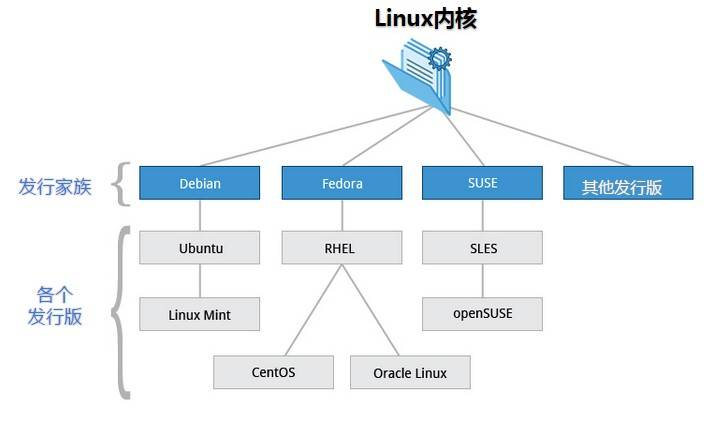

# Linux 入门笔记


## 1 Linux 家族

大体上来讲，Linux分为两个生态体系，红帽和debian。商业版本以Redhat为代表，开源社区版本则以debian为代表。 

【红帽家族 】

- redhat ：红帽自家服务器
- centos ：基于红帽重新封装的去掉版权信息的免费版本
- fedora ：基于红帽社区支持的桌面版，里面的包是红帽的实验版本，相对较新

包的管理方式：yum --> rpm

【debian家族】

- debian ：debian自家纯净系统，一般来说Debian作为适合于服务器的操作系统，它比Ubuntu要稳定得多。
- Ubuntu : 在debian系统上封装了许多工具，Ubuntu有着漂亮的用户界面，完善的包管理系统，强大的软件源支持，丰富的技术社区，但这也决定了它最佳的应用领域 是桌面操作系统而非服务器操作系统。
- Kali : Kali Linux 前身是 BackTrack（基于ubuntu），是一个基于 Debian 的 Linux 发行版，包含很多安全和取证方面的相关工具。

包的管理方式: apt --> deb

> 工作使用 CentOS，日常使用 Ubuntu，特殊用途 Kali Linux




## 2 Liunx 安装

### 2.1 虚拟机安装 Linux

- [VMware Workstation Pro 文档](https://docs.vmware.com/cn/VMware-Workstation-Pro/index.html)

#### 2.1.1 安装 VMware Workstation Pro

-  [官方下载地址](https://www.vmware.com/cn/products/workstation-pro/workstation-pro-evaluation.html) 【试用30天】

```sh
########## 激活码 ############
ZF3R0-FHED2-M80TY-8QYGC-NPKYF
YF390-0HF8P-M81RQ-2DXQE-M2UT6
ZF71R-DMX85-08DQY-8YMNC-PPHV8
```

#### 2.1.2 虚拟机网络配置

1、Workstation Pro 中的虚拟网络连接组件包括虚拟交换机、虚拟网络适配器、虚拟 DHCP 服务器和 NAT 设备。

- 虚拟交换机

  与物理交换机相似，虚拟交换机也能将网络连接组件连接在一起。虚拟交换机又称为虚拟网络，其名称为 VMnet0、VMnet1、VMnet2，以此类推。有少量虚拟交换机会默认映射到特定网络。

  默认虚拟机交换机：

  | 网络类型   | 交换机名称 |
  | ---------- | ---------- |
  | 桥接模式   | VMnet0     |
  | NAT        | VMnet8     |
  | 仅主机模式 | VMnet1     |

- 虚拟网络适配器

  在您使用**新建虚拟机**向导创建新的虚拟机时，向导会为虚拟机创建一个虚拟网络适配器。

- 虚拟 DHCP 服务器

  虚拟动态主机配置协议 (DHCP) 服务器可在未桥接到外部网络的配置中向虚拟机提供 IP 地址。例如，虚拟 DHCP 服务器可在仅主机模式和 NAT 配置中向虚拟机分配 IP 地址。

- NAT 设备

  NAT 配置中的 NAT 设备可在一个或多个虚拟机以及外部网络之间传送网络数据，识别用于每个虚拟机的传入数据包，并将它们发送到正确的目的地。

2、虚拟机网络连接配置

- 桥接模式网络连接

  桥接模式网络连接通过使用主机系统上的网络适配器将虚拟机连接到网络。如果主机系统位于网络中，桥接模式网络连接通常是虚拟机访问该网络的最简单途径。

- NAT 模式网络连接

  使用 NAT 模式网络时，虚拟机在外部网络中不必具有自己的 IP 地址。主机系统上会建立单独的专用网络。在默认配置中，虚拟机会在此专用网络中通过 DHCP 服务器获取地址。虚拟机和主机系统共享一个网络标识，此标识在外部网络中不可见。

- 仅主机模式网络连接

  仅主机模式网络连接可创建完全包含在主机中的网络。仅主机模式网络连接使用对主机操作系统可见的虚拟网络适配器，在虚拟机和主机系统之间提供网络连接。

- 自定义网络连接配置

  利用 Workstation Pro 虚拟网络连接组件，您可以创建复杂的虚拟网络。虚拟网络可以连接到一个或多个外部网络，也可以在主机系统中完整独立地运行。您可以使用虚拟网络编辑器来配置主机系统中的多个网卡，并创建多个虚拟网络

【正文开始！！！】

虚拟机NAT模式配置网络

【编辑】--> 【虚拟机网络编辑器】-->【NAT】


【控制面板】--> 【网络和共享中心】--> 【更改适配器】--> 选中【VMware Network Adapter VMnet8】-->【鼠标右键-属性】


#### 2.1.3 虚拟机安装 CentOS7.9

【镜像简介】

【0_README.txt】

```markdown
List of images in this directory
================================

CentOS-7-x86_64-DVD-2009.iso
  This DVD image contains all the packages that can be installed using the
  installer. This is the recommended image for most users.

CentOS-7-x86_64-NetInstall-2009.iso
  This is the network install and rescue image. The installer will ask from 
  where it should fetch the packages to be installed. This image is most 
  useful if you have a local mirror of CentOS packages.

CentOS-7-x86_64-Everything-2009.iso
  This image contains the complete set of packages for  CentOS Linux 7. It can be 
  used for installing or populating a local mirror. This image needs a 16GB USB 
  flash drive as it is too large for DVD isos.

CentOS-7-x86_64-LiveGNOME-2009.iso
CentOS-7-x86_64-LiveKDE-2009.iso
  These images are Live images of  CentOS Linux 7. Depending on the name they use the
  respective display manager. They are designed for testing purposes and
  exploring the  CentOS Linux 7 environment. They will not modify the content of your 
  hard disk, unless you choose to install  CentOS Linux 7 from within the Live
  environment. Please be advised that you can not change the set of installed
  packages in this case. This needs to be done within the installed system
  using 'yum'.

CentOS-7-x86_64-Minimal-2009.iso
  The aim of this image is to install a very basic  CentOS Linux 7 system, with the 
  minimum of packages needed to have a functional system. Please burn this image
  onto a CD and boot your computer off it. A preselected set of packages will be
  installed on your system. Everything else needs to be installed using yum. The set
  of packages installed by this image is identical to the one installed when choosing
  the group named "Minimal" from the full DVD image.

Using the installation images
=============================

You can burn these images to a DVD or 'dd' them to a USB flash drive. 
After the boot media has been prepared, boot the computer off the boot media. 
If you do an install to your hard disk using these installation images, please 
remember to run "yum update" after the installation to update your system to the 
latest packages.

Remember that in order to be able to partition your disk you will need to run
the GUI installer which in turns needs enough RAM. The same is true for the 
network setup step. Please refer to the release notes available at 
http://wiki.centos.org/Manuals/ReleaseNotes/CentOS7 for more details about
these aspects.
```


【正式开始！！！】


1、下载CentOS镜像

- [CentOS 官网 | 下载地址](https://www.centos.org/download/)
- [CentOS7.9 下载地址| CentOS-7-x86_64-DVD-2009.iso](http://mirrors.aliyun.com/centos/7.9.2009/isos/x86_64/CentOS-7-x86_64-DVD-2009.iso) 【可以直接下载这个】【使用的是阿里云的开源镜像站】

2、安装CentOS

---

（1）创建目录

---

```sh
| -- CentOS7.9.vmware	# 存放虚拟机文件
| -- CentOS7.9.iso		# 存放镜像文件
|    | -- CentOS-7-x86_64-DVD-2009.iso  # 镜像文件
```

---

（2）新建空白虚拟机

---


---

（3）导入CentOS镜像

---


【开启此虚拟机】Install CentOS 7


【等待安装完毕！ 重启！】

---

（4）系统优化

---

- 配置IP
- 配置主机名
- 安装常用组件

```sh
# 查看是否可以上网
[root@localhost ~]# ping www.baidu.com
PING www.a.shifen.com (14.215.177.39) 56(84) bytes of data.
64 bytes from 14.215.177.39 (14.215.177.39): icmp_seq=1 ttl=128 time=7.98 ms
64 bytes from 14.215.177.39 (14.215.177.39): icmp_seq=2 ttl=128 time=13.6 ms

# 查看主机ip
[root@localhost ~]# ip addr
1: lo: <LOOPBACK,UP,LOWER_UP> mtu 65536 qdisc noqueue state UNKNOWN group default qlen 1000
    link/loopback 00:00:00:00:00:00 brd 00:00:00:00:00:00
    inet 127.0.0.1/8 scope host lo
       valid_lft forever preferred_lft forever
    inet6 ::1/128 scope host 
       valid_lft forever preferred_lft forever
2: ens33: <BROADCAST,MULTICAST,UP,LOWER_UP> mtu 1500 qdisc pfifo_fast state UP group default qlen 1000
    link/ether 00:0c:29:a0:7f:3d brd ff:ff:ff:ff:ff:ff
    inet 192.168.60.129/24 brd 192.168.60.255 scope global noprefixroute dynamic ens33
       valid_lft 1653sec preferred_lft 1653sec
    inet6 fe80::b388:d738:a79:f61b/64 scope link noprefixroute 
       valid_lft forever preferred_lft forever
### 192.168.60.129/24 自动分配的ip，不是我们想要的ip

# 查看网络配置
[root@localhost ~]# cat /etc/sysconfig/network-scripts/ifcfg-ens33 
TYPE="Ethernet"
PROXY_METHOD="none"
BROWSER_ONLY="no"
BOOTPROTO="dhcp"
DEFROUTE="yes"
IPV4_FAILURE_FATAL="no"
IPV6INIT="yes"
IPV6_AUTOCONF="yes"
IPV6_DEFROUTE="yes"
IPV6_FAILURE_FATAL="no"
IPV6_ADDR_GEN_MODE="stable-privacy"
NAME="ens33"
UUID="ffb1283c-a300-4ffc-88c5-45b69cab1fe4"
DEVICE="ens33"
ONBOOT="yes"
### BOOTPROTO="dhcp" : dhcp自动分配，一会儿我们改成静态ip

# 备份
cp /etc/sysconfig/network-scripts/ifcfg-ens33 /etc/sysconfig/network-scripts/ifcfg-ens33.bak

# 更改网络配置
sed -i 's/BOOTPROTO="dhcp"/BOOTPROTO="static"/g' /etc/sysconfig/network-scripts/ifcfg-ens33
cat >> /etc/sysconfig/network-scripts/ifcfg-ens33 << EOF

IPADDR=192.168.60.200   # ipaddr
NETMASK=255.255.255.0   # netmask
GATEWAY=192.168.60.2    # gateway
DNS1=8.8.8.8            # dns
DNS2=114.114.114.114
EOF

# 重启网络服务，使配置生效
systemctl restart network

# 查看网络ip
[root@localhost ~]# ip addr
1: lo: <LOOPBACK,UP,LOWER_UP> mtu 65536 qdisc noqueue state UNKNOWN group default qlen 1000
    link/loopback 00:00:00:00:00:00 brd 00:00:00:00:00:00
    inet 127.0.0.1/8 scope host lo
       valid_lft forever preferred_lft forever
    inet6 ::1/128 scope host 
       valid_lft forever preferred_lft forever
2: ens33: <BROADCAST,MULTICAST,UP,LOWER_UP> mtu 1500 qdisc pfifo_fast state UP group default qlen 1000
    link/ether 00:0c:29:a0:7f:3d brd ff:ff:ff:ff:ff:ff
    inet 192.168.60.200/24 brd 192.168.60.255 scope global noprefixroute ens33
       valid_lft forever preferred_lft forever
    inet6 fe80::b388:d738:a79:f61b/64 scope link noprefixroute 
       valid_lft forever preferred_lft forever
### 192.168.60.200/24 是我们配置的ip

# 配置主机名
hostnamectl set-hostname CentOS79
# 退出用户，重新登录，使配置生效
exit
```

#### 2.1.4 Linux系统优化

[阿里巴巴开源镜像站](https://developer.aliyun.com/mirror/)

由于是最小安装，所以很多常用的组件均没有，需要手动安装。

CentOS自带官方yum源下载速度较慢，也优化一下。

```sh
# 安装常用组件
yum install -y vim net-tools wget screen lsof tcpdump nc mtr openssl-devel bash-completion lrzsz nmap telnet tree ntpdate iptables-services mailx zi
# 安装编译常用组件
yum install -y make gcc gcc-c++

# 配置epel
mv /etc/yum.repos.d/epel.repo /etc/yum.repos.d/epel.repo.bak
mv /etc/yum.repos.d/epel-testing.repo /etc/yum.repos.d/epel-testing.repo.bak
wget -O /etc/yum.repos.d/epel.repo http://mirrors.aliyun.com/repo/epel-7.repo
# 配置yum.repo
mv /etc/yum.repos.d/CentOS-Base.repo /etc/yum.repos.d/CentOS-Base.repo.bak
wget -O /etc/yum.repos.d/CentOS-Base.repo https://mirrors.aliyun.com/repo/Centos-7.repo


systemctl stop firewalld
systemctl disable firewalld

sed -i 's/SELINUX=enforcing/SELINUX=disabled/g' /etc/selinux/config
setenforce 0


# 优化字符集
localectl status 
##   System Locale: LANG=en_US.UTF-8
##       VC Keymap: us
##       X11 Layout: us
localectl set-locale LANG=zh_CN.UTF-8
cat /etc/locale.conf       #查看配置文件
##   LANG=zh_CN.UTF-8

# 优化ssh连接速度
# sed -i.bak 's@#UseDNS yes@UseDNS no@g;s@^GSSAPIAuthentication yes@GSSAPIAuthentication no@g'  /etc/ssh/sshd_config
# systemctl restart sshd

# 修改文件描述符最大限制，默认1024
ulimit -n
##  1024
# 【重启生效】
cat >> /etc/security/limits.conf << EOF
*                soft    nofile          65536
*                hard    nofile          65536
EOF
ulimit -n 65536

# 时间同步
yum install -y ntpdate
ntpdate ntp1.aliyun.com  

# 优化vim
mv /etc/vimrc /etc/vimrc.bak
curl https://raw.githubusercontent.com/wklken/vim-for-server/master/vimrc > ~/.vimrc
```

#### 2.1.5 虚拟机内网穿透

NAT 穿透，端口映射

（1）虚拟机网络配置中 【NAT网络】添加【端口转发】


（2）本地机器上，【控制面板】中的【Windows Defender 防火墙】中的【高级设置】，自定义【入站规则】


#### 2.1.6 虚拟机安装 UBuntu

[Ubuntu VMs on demand for any workstation](Ubuntu VMs on demand for any workstation)

1、下载镜像

- [UBuntu Download](https://ubuntu.com/download)

2、安装 UBuntu

（1）创建目录

```sh
| -- UBuntu.vmware	# 存放虚拟机文件
| -- UBuntu.iso		# 存放镜像文件
|    | -- ubuntu-21.10-desktop-amd64.iso  # 镜像文件
```

（2）新建空白虚拟机

- 【客户机操作系统】选择【Linux】【版本】选择【Ubuntu 64位】
- UBuntu推荐使用桌面系统

### 2.2 Linux 云服务器

- [云服务器ECS](https://www.aliyun.com/product/ecs?spm=5176.19720258.J_8058803260.32.e9392c4ad9bahC)


## 3 Linux 教程

### 3.1 Linux 启动过程

> 5个阶段

- 内核的引导。
- 运行 init。
- 系统初始化。
- 建立终端 。
- 用户登录系统。

> `init` 程序类型

- **SysV:** `init`, CentOS 5之前, 配置文件： `/etc/inittab`。
- **Upstart:** `init`,CentOS 6, 配置文件： `/etc/inittab`, `/etc/init/*.conf`。
- **Systemd：** `systemd`, CentOS 7,配置文件： `/usr/lib/systemd/system`、 `/etc/systemd/system`。


### 3.2 Linux 目录结构


以下是对这些目录的解释：

- **/bin**：
  bin 是 Binaries (二进制文件) 的缩写, 这个目录存放着最经常使用的命令。

- **/boot：**
  这里存放的是启动 Linux 时使用的一些核心文件，包括一些连接文件以及镜像文件。

- **/dev ：**
  dev 是 Device(设备) 的缩写, 该目录下存放的是 Linux 的外部设备，在 Linux 中访问设备的方式和访问文件的方式是相同的。

- **/etc：**
  etc 是 Etcetera(等等) 的缩写,这个目录用来存放所有的系统管理所需要的配置文件和子目录。

- **/home**：
  用户的主目录，在 Linux 中，每个用户都有一个自己的目录，一般该目录名是以用户的账号命名的，如上图中的 alice、bob 和 eve。

- **/lib**：
  lib 是 Library(库) 的缩写这个目录里存放着系统最基本的动态连接共享库，其作用类似于 Windows 里的 DLL 文件。几乎所有的应用程序都需要用到这些共享库。

- **/lost+found**：
  这个目录一般情况下是空的，当系统非法关机后，这里就存放了一些文件。

- **/media**：
  linux 系统会自动识别一些设备，例如U盘、光驱等等，当识别后，Linux 会把识别的设备挂载到这个目录下。

- **/mnt**：
  系统提供该目录是为了让用户临时挂载别的文件系统的，我们可以将光驱挂载在 /mnt/ 上，然后进入该目录就可以查看光驱里的内容了。

- **/opt**：
  opt 是 optional(可选) 的缩写，这是给主机额外安装软件所摆放的目录。比如你安装一个ORACLE数据库则就可以放到这个目录下。默认是空的。

- **/proc**：
  proc 是 Processes(进程) 的缩写，/proc 是一种伪文件系统（也即虚拟文件系统），存储的是当前内核运行状态的一系列特殊文件，这个目录是一个虚拟的目录，它是系统内存的映射，我们可以通过直接访问这个目录来获取系统信息。
  这个目录的内容不在硬盘上而是在内存里，我们也可以直接修改里面的某些文件，比如可以通过下面的命令来屏蔽主机的ping命令，使别人无法ping你的机器：

  ```
  echo 1 > /proc/sys/net/ipv4/icmp_echo_ignore_all
  ```

- **/root**：
  该目录为系统管理员，也称作超级权限者的用户主目录。

- **/sbin**：
  s 就是 Super User 的意思，是 Superuser Binaries (超级用户的二进制文件) 的缩写，这里存放的是系统管理员使用的系统管理程序。

- **/selinux**：
   这个目录是 Redhat/CentOS 所特有的目录，Selinux 是一个安全机制，类似于 windows 的防火墙，但是这套机制比较复杂，这个目录就是存放selinux相关的文件的。

- **/srv**：
   该目录存放一些服务启动之后需要提取的数据。

- **/sys**：

  这是 Linux2.6 内核的一个很大的变化。该目录下安装了 2.6 内核中新出现的一个文件系统 sysfs 。

  sysfs 文件系统集成了下面3种文件系统的信息：针对进程信息的 proc 文件系统、针对设备的 devfs 文件系统以及针对伪终端的 devpts 文件系统。

  该文件系统是内核设备树的一个直观反映。

  当一个内核对象被创建的时候，对应的文件和目录也在内核对象子系统中被创建。

- **/tmp**：
  tmp 是 temporary(临时) 的缩写这个目录是用来存放一些临时文件的。

- **/usr**：
   usr 是 unix shared resources(共享资源) 的缩写，这是一个非常重要的目录，用户的很多应用程序和文件都放在这个目录下，类似于 windows 下的 program files 目录。

- **/usr/bin：**
  系统用户使用的应用程序。

- **/usr/sbin：**
  超级用户使用的比较高级的管理程序和系统守护程序。

- **/usr/src：**
  内核源代码默认的放置目录。

- **/var**：
  var 是 variable(变量) 的缩写，这个目录中存放着在不断扩充着的东西，我们习惯将那些经常被修改的目录放在这个目录下。包括各种日志文件。

- **/run**：
  是一个临时文件系统，存储系统启动以来的信息。当系统重启时，这个目录下的文件应该被删掉或清除。如果你的系统上有 /var/run 目录，应该让它指向 run。

在 Linux 系统中，有几个目录是比较重要的，平时需要注意不要误删除或者随意更改内部文件。

**/etc**： 上边也提到了，这个是系统中的配置文件，如果你更改了该目录下的某个文件可能会导致系统不能启动。

**/bin, /sbin, /usr/bin, /usr/sbin**: 这是系统预设的执行文件的放置目录，比如 ls 就是在 /bin/ls 目录下的。

值得提出的是，/bin, /usr/bin 是给系统用户使用的指令（除root外的通用户），而/sbin, /usr/sbin 则是给 root 使用的指令。

**/var**： 这是一个非常重要的目录，系统上跑了很多程序，那么每个程序都会有相应的日志产生，而这些日志就被记录到这个目录下，具体在 /var/log 目录下，另外 mail 的预设放置也是在这里。

### 3.3 Linux 远程登录

1、远程工具登录。默认ssh端口22。

[FinalShell 下载地址](http://www.hostbuf.com/t/988.html)


2、终端登录

```sh
# 安装ssh
yum install -y ssh
# 启动ssh
service sshd start
# 登录远程服务器[Linux终端 | Windows终端 均可]
ssh -p 22 root@192,168.60.200
# 	password：输入密码

### Windows终端 ###
C:\Users\admin>ssh -p 22 root@192.168.60.200
The authenticity of host '192.168.60.200 (192.168.60.200)' can't be established.
ECDSA key fingerprint is SHA256:gZpJxuIKRUTj1Um7fHvmd4rEPKo9OYzAHiNHLNNYMeo.
Are you sure you want to continue connecting (yes/no)? yes
Warning: Permanently added '192.168.60.200' (ECDSA) to the list of known hosts.
root@192.168.60.200's password:
Last login: Mon Jan 10 10:37:35 2022 from 192.168.60.1
```

### 3.4 Linux 文件

- `chown` (change owner) ： 修改所属用户与组。
- `chmod `(change mode) ： 修改用户的权限。


1、chgrep：更改文件属组

```sh
chgrp [-R] 属组名 文件名
```

2、chown：更改文件属主，也可以同时更改文件属组

```sh
chown [–R] 属主名 文件名
chown [-R] 属主名：属组名 文件名
```

3、chmod：更改文件9个属性

```
 chmod [-R] xyz 文件或目录
```

### 3.5 Linux 目录

- ls（英文全拼：list files）: 列出目录及文件名
- cd（英文全拼：change directory）：切换目录
- pwd（英文全拼：print work directory）：显示目前的目录
- mkdir（英文全拼：make directory）：创建一个新的目录
- rmdir（英文全拼：remove directory）：删除一个空的目录
- cp（英文全拼：copy file）: 复制文件或目录
- rm（英文全拼：remove）: 删除文件或目录
- mv（英文全拼：move file）: 移动文件与目录，或修改文件与目录的名称

### 3.6 Linux 用户

1、添加新的用户账号使用useradd命令

```sh
useradd 选项 用户名
```

2、删除帐号

```sh
userdel 选项 用户名
```

3、修改账号

```sh
usermod 选项 用户名
```

4、用户口令管理

```sh
passwd 选项 用户名
```

5、增加用户组

```sh
groupadd 选项 用户组
```

### 3.7 Linux 磁盘

- **df**（英文全称：disk full）：列出文件系统的整体磁盘使用量
- **du**（英文全称：disk used）：检查磁盘空间使用量
- **fdisk**：用于磁盘分区


## 4 Linux vim

```sh
# 安装
yum install -y vim
# 配置
curl https://raw.githubusercontent.com/wklken/vim-for-server/master/vimrc > ~/.vimrc
```

- [vim 学习](https://coolshell.cn/articles/5426.html)

### 4.1 vim 配置文件

```sh
vim /etc/vimrc
```

### 4.2 vim 基础快捷键

- 注意
  - 严格区分字母大小写
  - 含有 `Ctrl` 字眼都表示 Ctrl 键盘按钮
  - 特定符号需要配合 Shift 键，比如字母键盘区上面的数字区：!@#%%^&*()
  - 要按出冒号键 `:` 也是需要 Shift 的
- 移动
  - `j`，下
  - `k`，上
  - `h`，左
  - `l`，右
  - `v`，按 v 之后按方向键可以选中你要选中的文字
  - `gg`，跳到第 1 行
  - `G`，跳到最后一行
  - `16G` 或 `:16`，跳到第 16 行
  - `$`，到本行 行尾
  - `0`，到本行 行头
  - `w`，到下一个单词的 开头
  - `e`，到下一个单词的 结尾
  - `Ctrl + u`，向文件 首翻 半屏
  - `Ctrl + d`，向文件 尾翻 半屏
  - `Ctrl + f`，向文件 尾翻 一屏
  - `Ctrl + b`，向文件 首翻 一屏
  - `*`，匹配光标当前所在的单词，移动光标到 下一个 匹配单词
  - `#`，匹配光标当前所在的单词，移动光标到 上一个 匹配单词
  - `^`，到本行第一个单词头
  - `g_`，到本行最后一个单词尾巴
  - `%`，匹配括号移动，包括 (、{、[
- 插入
  - `I`，在当前 行首 插入
  - `A`，在当前 行尾 插入
  - `i`，在当前字符的 左边 插入
  - `a`，在当前字符的 右边 插入
  - `o`，在当前行 下面 插入一个新行
  - `O`，在当前行 上面 插入一个新行
- 编辑
  - 删除
    - `x`，删除 光标后 的 1 个字符
    - `2x`，删除 光标后 的 2 个字符
    - `X`，删除 光标前 的 1 个字符
    - `2X`，删除 光标前 的 2 个字符
    - `dd`，删除当前行
    - `cc`，删除当前行后进入 insert 模式
    - `dw`，删除当前光标下的单词/空格
    - `d$`，删除光标至 行尾 所有字符
    - `dG`，删除光标至 文件尾 所有字符
    - `3dd`，从当前光标开始，删掉 3 行
    - `echo > aa.txt`，从 bash 角度清空文件内容，这个比较高效
  - 复制
    - `y`，复制光标所选字符
    - `yw`，复制光标后单词
    - `yy`，复制当前行
    - `4yy`，复制当前行及下面 4 行
    - `y$`，复制光标位置至 行尾 的内容
    - `y^`，复制光标位置至 行首 的内容
  - 粘贴
    - `p`，将粘贴板中内容复制到 光标之后
    - `P`，将粘贴板中内容复制到 光标之前
  - 其他
    - `ddp`，交换当前光标所在行和下一行的位置
    - `u`，撤销
    - `:wq`，退出并 保存
    - `:q!`，退出并 不保存
    - `Ctrl + v`，进入 Vim 列编辑
    - `guu`，把当前行的字母全部转换成 小写
    - `gUU`，把当前行的字母全部转换成 大写
    - `g~~`，把当前行的字母是大写的转换成小写，是小写的转换成大写
    - `:saveas /opt/setups/text.txt`，另存到 /opt/setups/text.txt
- 搜索
  - `/YouMeek`，从光标开始处向文件尾搜索 YouMeek 字符，按 `n` 继续向下找，按 `N` 继续向上找
  - `?YouMeek`，从光标开始处向文件首搜索 YouMeek 字符，按 `n` 继续向下找，按 `N` 继续向上找
- 替换
  - `:%s/YouMeek/Judasn/g`，把文件中所有 YouMeek 替换为：Judasn
  - `:%s/YouMeek/Judasn/`，把文件中所有行中第一个 YouMeek 替换为：Judasn
  - `:s/YouMeek/Judasn/`，把光标当前行第一个 YouMeek 替换为 Judasn
  - `:s/YouMeek/Judasn/g`，把光标当前行所有 YouMeek 替换为 Judasn
  - `:s#YouMeek/#Judasn/#`，除了使用斜杠作为分隔符之外，还可以使用 # 作为分隔符，此时中间出现的 / 不会作为分隔符，该命令表示：把光标当前行第一个 YouMeek/ 替换为 Judasn/
  - `:10,31s/YouMeek/Judasn/g`，把第 10 行到 31 行之间所有 YouMeek 替换为 Judasn

### 4.3 vim 特殊复制、黏贴

- Vim 提供了 12 个剪贴板，分别是：`0,1,2,3,4,5,6,7,8,9,a,"`，默认采用的是 `"`，也就是双引号，可能你初读感觉很奇怪。你可以用 Vim 编辑某个文件，然后输入：`:reg`。
- 复制到某个剪切板的命令：`"7y`，表示使用 7 号剪切板。
- 黏贴某个剪切板内容：`"7p`，表示使用 7 号剪切板内容进行黏贴


## 5 Linux yum

### 5.1 yum 常用命令

- 列出所有可更新的软件清单命令：**yum check-update**
- 更新所有软件命令：**yum update**
- 仅安装指定的软件命令：**yum install <package_name>**
- 仅更新指定的软件命令：**yum update <package_name>**
- 列出所有可安裝的软件清单命令：**yum list**
- 删除软件包命令：**yum remove <package_name>**
- 查找软件包命令：**yum search <key_word>**
- 清除缓存命令:
  - **yum clean packages**: 清除缓存目录下的软件包
  - **yum clean headers**: 清除缓存目录下的 headers
  - **yum clean oldheaders**: 清除缓存目录下旧的 headers
  - **yum clean, yum clean all (= yum clean packages; yum clean oldheaders)** :清除缓存目录下的软件包及旧的 headers


## 6 Linux apt

### 6.1 apt 常用命令

- 列出所有可更新的软件清单命令：**sudo apt update**

- 升级软件包：**sudo apt upgrade**

  列出可更新的软件包及版本信息：**apt list --upgradeable**

  升级软件包，升级前先删除需要更新软件包：**sudo apt full-upgrade**

- 安装指定的软件命令：**sudo apt install <package_name>**

  安装多个软件包：**sudo apt install <package_1> <package_2> <package_3>**

- 更新指定的软件命令：**sudo apt update <package_name>**

- 显示软件包具体信息,例如：版本号，安装大小，依赖关系等等：**sudo apt show <package_name>**

- 删除软件包命令：**sudo apt remove <package_name>**

- 清理不再使用的依赖和库文件: **sudo apt autoremove**

- 移除软件包及配置文件: **sudo apt purge <package_name>**

- 查找软件包命令： **sudo apt search <key_word>**

- 列出所有已安装的包：**apt list --installed**

- 列出所有已安装的包的版本信息：**apt list --all-versions**

